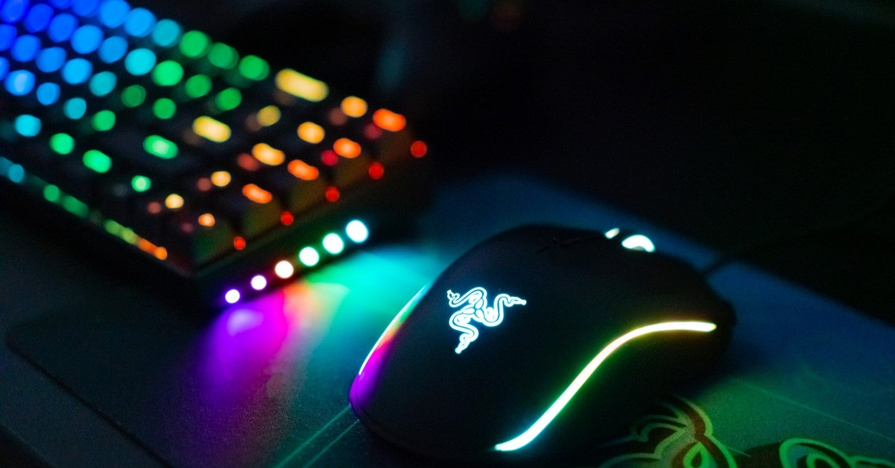

<figure>

</figure>

　ゲーミングデバイスはどれもかっこいいデザインだ。大抵は黒くて、ブランドのロゴやボタンなどがLEDでカラフルに輝いている。その硬質感はクールで、ゲームをプレイする手にも自然力が入る。

　しかし、どのメーカーのゲーミングデバイスも似たか寄ったかの見た目になってしまうのには大いに不満を感じる。試しに、家電量販店の通販サイトで「ゲーミング」と検索してみるといい。似たようなマウス、似たようなキーボード、似たようなヘッドセットが大量に現れる。PC本体ですら、同じような配色で同じような虹色LEDだ。

　ときどき変わり種で、ピンクやホワイトが混じっているが、圧倒的に少数だ。どうして、ゲーミングデバイスはどれもこれも似たようなデザインに寄せてくるのか、まったくもって不思議である。

　黒は無難でかっこいいとも言えるが、その分横並びでつまらないとも言える。もっと言ってしまえば、子供っぽくてダサい。かっこいいのにダサい。この内なる矛盾を抱え込んだ周辺機器がゲーミングデバイスの現実だ。

　そろそろゲーミングデバイスも世に普及し、メーカーはそろそろデザインのバリエーションを考える頃だろう。プロゲーマーという存在も、一定の認知度を得て、世の中に知られるようになったのだから、プロ用の漆黒のデザインと、一般人用のポップなデザインと分けるような流れができたっていい。

　とにかく、バカのひとつ覚えで黒い筐体、レインボーに光るLEDの組み合わせに統一することはないのだ。もっとシックなデザインのゲーミングデバイスや、アヴァンギャルドな色彩感覚でデザインされたゲーミングデバイスが登場することを願っている。

　今日は、新しく手に入れたゲーミングノートPC用に、RAZERのマウス『VIPER MINI』を購入しながらそんなことを考えていた。
