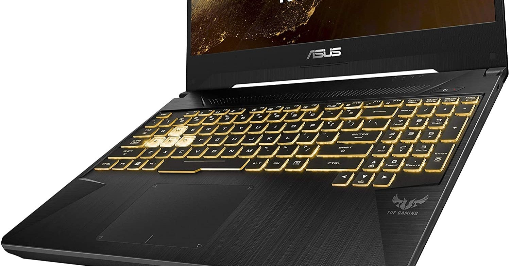

<figure>

</figure>

 ゲーミングノートというものを初めて買った。3Dのゲームが動くグラボが載っていて、キーボードがピカピカ光るやつだ。

　実はASUSのサイトですごく安く売っているモデルがあるのだが、それを買った。もちろん性能は価格相応で、グラボもメモリもあまりパワフルではない。普段よく遊ぶゲームで言えば、『デッドバイデイライト』がグラフィックの設定を落として快適に遊べる程度である。

　実は長らく使ってきたアップル製のノートPCとそろそろ決別しようかと思っている。Windowsノートを選択すれば、それなりの性能のものが安く手に入るのに、MacBook Proではそうはいかない。それは昔からそうだったのだが、ここへ来てとくに顕著になっている。しかも、最近はゲームをプレイする環境がPCに移ってきているので、余計にWindwosのマシンが欲しい。ノートPCはいつも必要なので、それならばということでゲーミングノートにしたわけだ。

　ついでに言うと、ずっと使っているMac Miniのサーバや、iPhoneなんかもNASやAndroidに移行するのもありかなと思っている。もうあまりアップル製品に魅力を感じていないということだ。

　これでASUSのノートPCは3台目になるが、過去の2台はとても甲斐甲斐しく働いてくれて、5万円～7万円程度の価格帯に収まるのに、お値段以上のパフォーマンスを発揮してくれていた。今回も同じ価格帯ではあるが、きっと活躍してくれると信じている。

　とりあえず、最初にSteamクライアントを入れ、真っ先に『デッドバイデイライト』をインストールした。nVidia搭載機種を選んだので、Geforce Experienceでゲーム画面の録画も良好。これでビデオ編集を入れたら、いつでもYouTubeに動画をアップできるというわけだ。それが主な目的というわけではないが、こういうことがその場でできるというのは魅力的である。

　あとは、いつも書いているPC環境の自動化スクリプトみたいなものを初め、以前は趣味でちょこちょことやっていたプログラムを試しても楽しいかなと思っている。

　1台ノートPC買っただけで夢が広がるお手軽人生だ。
