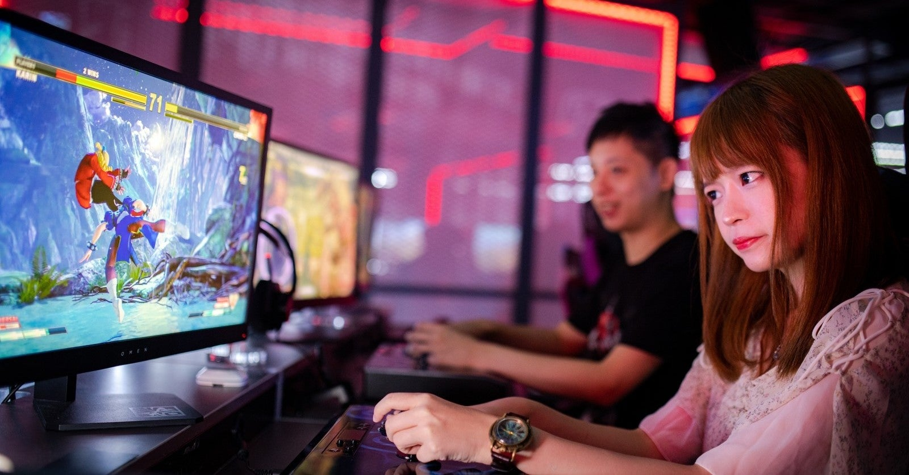

<figure>

</figure>

　ツイッターでモンハンの話を見かけた。

[https://twitter.com/taeinu/status/1308620730221785088](https://twitter.com/taeinu/status/1308620730221785088)

　オンラインでゲームをやっていると、特にチーム戦になるようなゲームの場合、どうしてこうしないんだということを言ってくる人は必ずいる。しかし、ゲームでそう言ってくる人のプレイスタイルに合わせる必要はないし、必ずしもそのやり方が、万人にとってゲームを楽しむ方法とは限らない。

　これは、ゲームに限らないことかもしれないが、世の中にはいろいろな考えの人がいて、それぞれの多様な生き方を謳歌する権利がある。もちろん、我々の世界にも、ゲームの世界にもルールがあって、それを守らなければならないが、ときにはそのルールに異を唱えるような場合もあってよい。（それが認められるかどうかは、また別問題だけど）

　ところが、それを許容できない人が一定数いるから揉め事になる。冒頭に引用したツイートにも、勝手なことを言うな、お前の方がわかっていない、身勝手だ。そういうリプライがたくさんついていた。SNSの特徴でもあるが、ひとり叩く人がいて、味方がいると感じると、ここぞとばかりに尻馬に乗って叩き始める心理もあるのだろう。

　しかし、ゲームの楽しみ方は人それぞれである。他人に強要されて義務を伴ってプレイスタイルを決定されることなどない。特に、ゲームシステムで枠組みがないとすれば、その遊び方までどうして他人に強制される必要があろうか。ごく当たり前の話である。

　もちろん、チャットでアドバイスをしたり、よりよいプレイを推奨するようなコミュニケーションがあってもいいだろう。それも自由なプレイスタイルだ。しかし、だからと言ってそれに過剰に反応して、ゲームに嫌気が差したり、従わなければいけないという同調圧力を感じる必要もないように思う。

　こうして考えると、これはゲームの問題ではなく、SNS上でのトラブルなどに近いコミュニケーションの問題だということがわかってくる。オンラインゲームがどうこうではなく、他人の自由なプレイスタイルを許せず、人からアドバイスを受けることにストレスを感じる、そういう人と人との関わり方の問題だ。コミュニケーションに齟齬が生じやすい、オンラインのやり取りが発達した、現代社会の病理とさえ言える。いずれにしても、コミュニケーションの柔軟さ、適切な意思の伝え方、受け取り方、その双方に課題があるのではないだろうか

　僕は常日頃、ゲームに大切なもののひとつに、多様性があると主張している。誰がプレイしても同じものが同じように進行するゲームより、100人がプレイしたら100通りの遊び方と結果が生じる。そういうゲームの方が、豊かなゲーム体験なのではないかと考えているのだ。

　ゲームをプレイすることは、元来もっと自由だったはずだ。誰からも強制されず、好きなゲームを好きなように遊ぶ。それがゲームをプレイする理想の姿だ。しかし、現代において様々なテクノロジーの進化と、新たに生み出された先進的なゲームシステムによってプレイヤーとプレイヤーの関わりが強くなった。もしかすると、こういう進化によって、一方でゲームをプレイすることの自由さが失われようとしているのかもしれない。

　半世紀に渡り進化を続けてきたビデオゲーム。どうやら、次に進化するべきはそれをプレイする人間なのかもしれない。願わくば、すべての人が自由にゲームを謳歌できますように。
