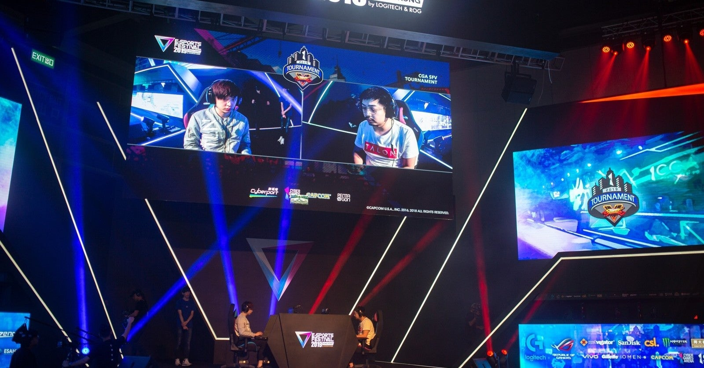

<figure>

</figure>

　オンラインで東京ゲームショウが開催されているらしい。実はこれまでに東京ゲームショウへ行ったことはない。AOUショウなら行ったことがある。どちらかと言えば、やっぱりゲーセンのゲームの方が興味があったからだ。今はゲーセンも下火でそうでもない。

　しかし、いつもならツイッターに流れてくる最新ゲームの写真が、今年はまったくない。オンラインだから当たり前だ。だから、こちらから映像を見に行かない限りはどんな新製品が待っているのかわからない。

　新しいXboxの、ローンチソフトがなんなのか。そういうのもわからない。いや、PS5だってソフトは何が出るのか知らない。そんな状態だ。しかも、両方ともとりあえず様子見で買う予定がないので、次世代のゲーム機について調べようとも思っていない。結果、全然新作ソフトのことはわからない。これからどんなゲームが発売されるのだろう。

　そう考えてみると、最近は、最新ゲームの情報を懸命に集めることもなくなった。ゲームニュースのサイトも読んでいるが、隅から隅までというほどでもない。Steamなどのクライアントを開いて、そこで宣伝される新製品ぐらいは見るかもしれない。でも、これは必ずしも家庭用ゲーム機で今後発売される話題のソフトとは一致しない。つまり、ほぼ新作ゲームの情報を仕入れようとしていないということだ。

　自分が年をとったせいもあるが、同時に、数年経っても楽しめる、本当に面白いゲームを見つけて、それをやり込むというプレイスタイルに変化してきているのかもしれない。加えて、昔はアーケードゲームの委嘱作品などと言えば、確実に買っていたのも、品を選んで買うようになった。全部網羅する必要はないと思っている。

　オンラインのゲームショウがきっかけで、ゲームとの付き合い方が変化したというわけではない。自分にとっては、少し前から、こういうゲームとの向き合い方が普通になっていたのだろう。今回のオンラインゲームショウで、そのことに気付かされた。そして、SNSに流れてこない情報は、びっくりするぐらい自分のアンテナに引っかからない。ネット時代の功罪と言ったところか。今日は少し、ゲームメディアのサイトでも巡回してみることにしよう。
