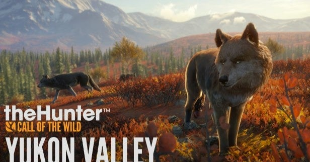

<figure>

</figure>

　今日まで進化を遂げてきたビデオゲームは、そのいちジャンルとして、ゲームの中で生活を成り立たせ、スローライフとも言える循環型ゲームサイクルを作り出すことを目的とするようなゲームが登場してきた。

　なんのことを言ってるのかよくわからないかもしれない。『マインクラフト』や『ファーミングシミュレーター』、日本で言えば『牧場物語』などなど、ゲーム内で生活インフラを整え、それを回しながら長い期間遊んでいく、もっと言えばゲームの世界で生き抜いていくゲームのことだ。

　僕もこういうゲームが好きで、いろいろと手を出してみた。『マインクラフト』なんかも一時期よくやっていて、自分の砦を作り、鉱山を整え、線路を敷き、農場を作って生活を充実させていた。

　しかし、しばらく遊んでいると飽きる。順風満帆なスローライフに、刺激を求めてしまうのである。農作物を収穫するより、敵はどこだ！　銃を持って突入の準備だ！　ゾンビを狩って根絶やしにしろ！　とばかりに、自分から外の世界へ打って出たくなってしまう。

　これはもう性格だから仕方ないのだが、どうしてもゲームに過剰な刺激を求めてしまい、農業シムや無人島サバイバルシムに飽きて、銃や刀剣を持って敵と戦うゲームに戻っていってしまう。きっと、根っこが農耕民族じゃなく、狩猟民族なのだろう。

　そんな僕が、最近注目しているゲームがある。Steamなどで販売されている『theHunter: Call of the Wild』というゲームである。これは、ライフルを携えて森や山に出かけ、大自然の中に暮らす鹿や鳥、その他の動物をハンティングするというゲームだ。もう3年も前に発売されたゲームではあるが、僕の欲しい物リストの中で2年間眠り続けている。

　動物をハンティングするということで、非常に狩猟意識を刺激されるゲーム内容ではあるが、一方で大自然の中をさまよい歩く、ハンターシムとも言えるこのゲーム。決してライフルを連射するようなゲーム性ではなく、広大な森の中に罠を仕掛け、どこにいるともしれない野生動物を長時間待ち続ける、長期戦当たり前のゲームになっているようだ。

　そんなわけで、果たして気が短く、せっかちな僕に、野生動物の出現を待つことができるのか。そんな懸念が、狩猟という興味深いテーマを持ちながら、長年欲しい物リストから購入へ至らない理由となっているのだ。

　今でもときどき、Steamの『theHunter: Call of the Wild』レビューを読んで、本当に遊びたい欲を刺激されている。Steamのレビューは実によく書けているものが多く、このゲームのプレイ感が、遊んでいないものにもすごく詳細に伝わってくる。そして、長年ゲームをやっている自分には、遊んだときの感触も、ほぼ齟齬がなく理解できていると思う。大自然の中で動物を探すことはきっと楽しいだろう。それは間違いない。しかし、なかなか捉えることができない動物たちに嫌気が差し、飽きてくる自分の姿も予想できる。

　大自然とともにスローライフを過ごす『theHunter: Call of the Wild』を買うべきか否か。これはゲームの値段の問題ではない。自分がそういうところにチャレンジしていけるかどうか、己との戦いのような気がしてしまっているのだ。

　だから未だに買えない。

[https://store.steampowered.com/app/518790/theHunter\_Call\_of\_the\_Wild/?l=japanese](https://store.steampowered.com/app/518790/theHunter_Call_of_the_Wild/?l=japanese)
