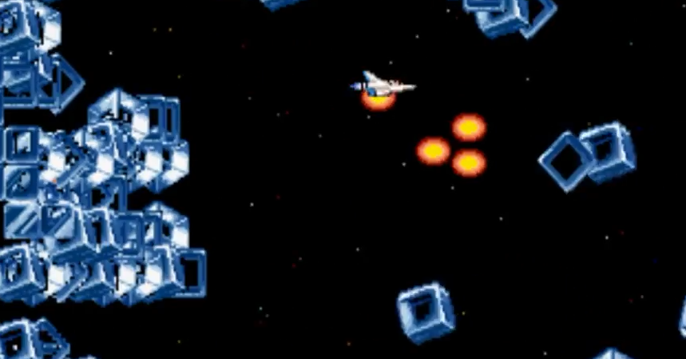

<figure>

</figure>

　『グラディウスIII』はゲーセンであまりプレイしなかった。単に難しかったというのもあるが、それに加えて、疑似3Dのあまり楽しくないステージがあったり、随所で当たり判定がおかしかったり、とにかく遊びやすいゲームではなかったからだ。だからあまり思い出もない。おわり。

　というわけにもいかないので、もう少し書くか。あまりいい印象のなかった『グラディウスIII』だが、音楽は好きだった。サントラを買って結構聞いた。

　その後、スーファミでアレンジ移植みたいな『グラディウスIII』が出たが、これはかなり遊んだ。難易度がかなりマイルドになっていたのもあるが、要するに家で遊ぶような攻略のめんどくさいゲームだったのだ。

　PS2で、『グラディウスIII』と『グラディウスIV』がカップリングされた移植が出たが、これで初めて『グラディウスIII』の最終面を見ることができた。1周プレイしてみると、改めてひどいゲームだと思った。とにかくいじわる、遊びにくい、めんどくさい、そういうギミックに満ちたゲームなのだ。いたるところで処理落ちが起きるので、爽快感もない。かと言って、処理落ちがなければ、到底避けられないような攻撃が目白押し。なんとも困ったゲームなのだ。

　特に、キューブと呼ばれる敵（障害物？）が飛んできて積み重なるステージの意味不明さ。これをどう楽しめばいいのか、最後までわからなかった。いや、今もわからない。

[https://twitter.com/keigox68000/status/1107290059475042304](https://twitter.com/keigox68000/status/1107290059475042304)

　そんな『グラディウスIII』が、アーケードアーカイブスで登場と来たら、これは盛り上がらないわけがない。伝説のゲームはいつでも復活する。そんな趣がある。

　なんだかんだ言って、今から発売日が楽しみなゲームではある。いろんな意味で。首を長くして待っていよう。
