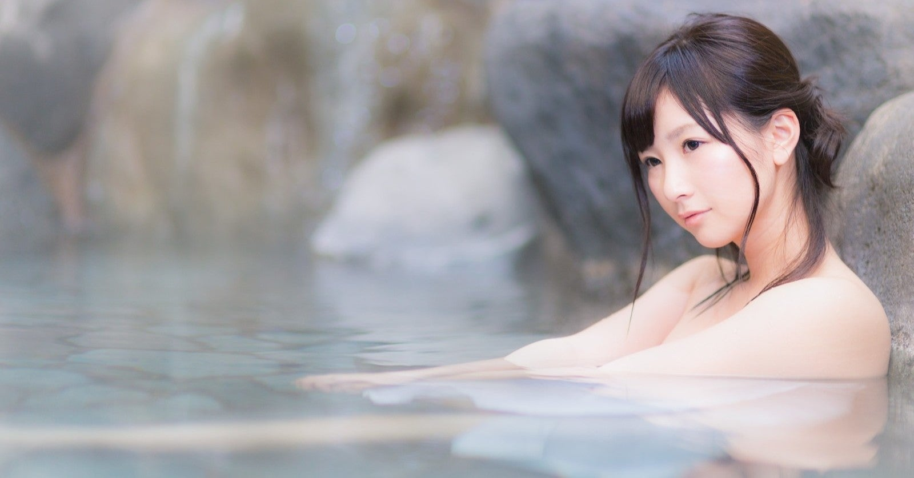

<figure>

</figure>

　温泉と言えば、誰もが愛するヒーリングスポット。日本人なら、とりあえず温泉行っとけば休暇の使いみちはオールオーケー。日頃の疲れも全回復。みたいな、あの温泉である。

　ところが、僕はそんなに温泉が好きじゃない。いや、別に嫌いじゃない。でも、温泉へ行っても、せいぜい風呂に入るのは15分程度。ひどいときは5分ぐらいで出てきてしまう。

　理由は単純明快。じっとお湯に使っているのが暇なのである。風呂は嫌いではないが、主に汗を流すのが目的で、それ以上のものを求めない。一刻も早くあがってゲームがしたい、ぐらいの勢いなのである。

　さらに、僕は熱い風呂が苦手だ。温泉と言えば、40度以上のところもあったりする。もうリアルに拷問だ。正直身体じゅうのタンパク質が凝固してしまうんじゃないかと思うぐらい熱い。どうしてみんな、あんな熱いところに入れるのか。ちなみに、夏の暑さも、熱い味噌汁も全部苦手だ。

　極めつけは、肩も凝らないし、腰痛もないので、お湯につかって疲れを取ろうという発想にならないということ。日常のストレスを解消するのにもいいと言うが、あまりストレスを感じて生きていないので、それも必要ない。むしろ、熱い湯に入る方がストレスだ。

　そんなわけで、温泉はそんなに好きではない。別に嫌いじゃない。だから、ときどき行く。だいたいすぐにあがってしまうので、温泉にはゲームコーナーがあると暇が潰せていいなと思っている。
