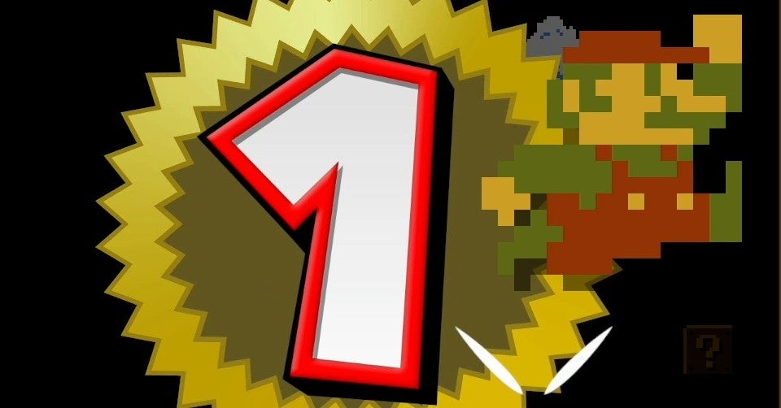
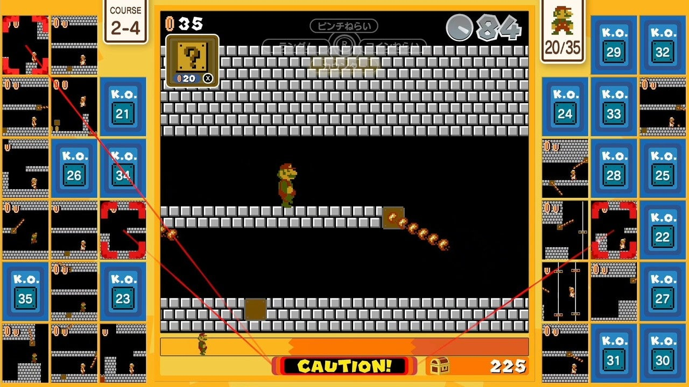

<figure>

</figure>

　気づいたら『スーパーマリオブラザーズ35』なんてゲームが出ていた。今となってはあまりマリオのゲームも遊ばないので、先日のオンラインのゲームショーでも、マリオ関連の情報を見ていなくて、こんなゲームがリリースされることすらよく知らなかった。もっと言うと、どんなゲームかもわかっていなかった。

　しかし、無料ということもあって、ちょっとダウンロードしてみることにした。現金なものである。

　ゲームを起動してみてびっくり。99人で対戦する『テトリス99』と同じような画面構成なのである。これを見ただけでわかった。要するに35人で『スーパーマリオブラザーズ』をプレイして、最後の1人になるまで勝ち抜けというゲームなのだ。わかりやすい。

　早速プレイしてみて、徐々にルールが理解できた。ファイヤーや踏み潰しで敵を倒すとタイムが増え、倒した敵は対戦相手に送り込めるというシステムだ。タイムが0になるか、穴に落ちると負け。対戦から脱落というわけだ。

　いくら『テトリス99』が人気だからって、その対戦システムをそのまま持ってきて『スーパーマリオブラザーズ』やらせるのは、あまりに安直すぎるんじゃないか任天堂。そう思った。

　敵を送り込めるというルールも、『テトリス』でブロックを送り込むのをそのまま持ってきただけで、こんなのゲームになるのか。そんな気もした。

　ところが、これが意外に遊べるのである。いや、意外にどころか、かなり熱中してしまった。

　簡単なステージで敵を倒し、タイムを増やすことが負けないための基本的な戦略であるが、それだけでは、対戦相手との単なるガマン大会になってしまう。積極的に勝つためには、先のステージへ進み、クッパやハンマーブロスのような強い敵を送り込むこむのがよさそうだ。しかし、無理をすれば自分の首を絞める。この辺りのバランスが思ったよりよくできている。

　どうしても、終盤がガマン大会になる感じはあるが、プレイを重ねてくると、それを打破するための戦略を考えようとする。相手のミスを待っているだけの受動的プレイから抜け出そうとする仕組みが存在する。その辺が良くてきていると思った。

　今はまだ、ゲームがリリースされたばかりなので、全体的に消極的な対戦スタイルが多いが、このゲーム、もしかしたら世界中のプレイヤーたちが対戦を重ねることで、あらたな戦いが見られるようになるのかもしれない。

　『スーパーマリオブラザーズ』にあまり興味がない僕であるが、対戦となると、ちょっと今後の動向を見守りたい楽しさがあると感じた『スーパーマリオブラザーズ35』であった。しばらくプレイを継続してみたい。

[https://www.youtube.com/watch?v=2CUAJtyxBow](https://www.youtube.com/watch?v=2CUAJtyxBow)
