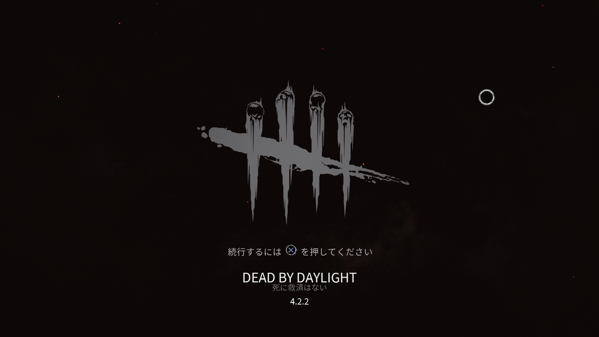

<figure>

</figure>

　PS5では、決定ボタンがOボタンに統一されるそうだ。まあ、統一したほうがいいだろう。

　国内では、Xbox360で和洋入り乱れてゲームが出るようになった辺りから、OボタンとXボタンのどちらが決定ボタンなのかが混乱するようになったような気がする。

　さらに、ゲーム機によって、OボタンだったりAボタンだったり、AボタンBボタンでも場所が違ったり、とにかく各メーカーが独自色を出そうとするものだから、ゲームのユーザーインターフェースは一層混迷を極めている。

　そもそもゲームなんて、一番入力に気を使うソフトウェアのような気がするのだが、ユニバーサルデザインとか、そういう概念がすごく疎かにされているのは、ゲーム業界どうなっているのかな？　という気がする。ついでに言えば、最近ではすごく小さな液晶画面のゲーム機とか盛り上がっているけど、ああいうのもユニバーサルデザインの観点からするとまったくダメだ。

　で、話がそれたのでもとに戻すと、やはり誰がプレイしても、どんな文化がプレイヤーの背景にあっても、絶対間違えない操作をするには、やっぱりゲーム画面上に使うボタンを表示するしかないのだろう。

　「PS5で決定ボタンは統一します」と、ソニーが意気揚々と宣言したとしても、所詮それはPS5だけの話。他のゲーム機も存在する世の中で、ひとつのゲーム機がOという同時のマークに意味をもたせても、全然ユニバーサルじゃないのだ。仮に、すべてのゲーム機のボタンが同じデザインで、その上で同じ決定ボタンに統一するのなら、これはユニバーサルデザインかもしれない。でも多分それはありえない。僕もユーザーとして望んでいない。

　だからもう、画面に逐一表示するしかないのだ。表示が邪魔な人は、オプションからアシストを消せるようにすればいい。いろんな人がゲームをプレイする昨今、ゲームの作り手はそれぐらいのことは考えた方がいい。もちろんすごく丁寧に考えられているゲームもある。しかし、すべてのゲームがそうならなければ意味がないのだ。（ソニーもそう考えたから、統一するなどといい出したのだろう）

　とりあえず、今すぐなんとかしてほしいのは、『デッドバイデイライト』のスタート画面で「Xボタンを押してください」と表示されながら、実はOボタンでないと先に進まない間違いと、シューティングゲームでゲーム開始直後の誤ボムを押したときに「それはボムボタンですが発射していいですか？」と表示するシステムだ。それだけでゲーム業界変わったな、という感じになるだろう。

