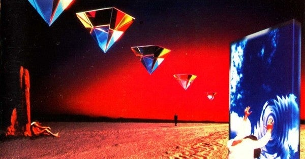

<figure>

</figure>

　秋も深まってきて、今度はメロディアス・ハードを聞こう！　とばかりに10枚ほど選んでみました。10枚じゃ全然足りてないんだけど、まあとりあえず行ってみよう！

## 1\. BURNS LIKE A STAR / STONE FURY

　レニー・ウルフのヴォーカルが煌めく切れ味良い名盤

[https://www.youtube.com/watch?v=KbKR5EPRB34](https://www.youtube.com/watch?v=KbKR5EPRB34)

## 2\. 2 FORGIVE IS 2 FORGET / GLORY

　ヤン・グランウィックのギターがちょっと地味だけど、メロディを大切にしていていい感じなのだ

[https://www.youtube.com/watch?v=UQfW-6T5zAY](https://www.youtube.com/watch?v=UQfW-6T5zAY)

## 3\. EXCESS ALL AREAS / SHY

　80年代ならではのキラキラサウンドとトニー・ミルズ（2019R.I.P）のヴォーカルが渾然一体となって迫りくる

[https://www.youtube.com/watch?v=apmWdCSc11w](https://www.youtube.com/watch?v=apmWdCSc11w)

## 4\. NEVER SAY SURRENDER / RED DAWN

　デヴィッド・ローゼンタールやチャック・バーギ、グレッグ・スミスなどRAINBOWを想起させるメンバーの、極上ハードポップバンド

[https://www.youtube.com/watch?v=uOrkxIbBPPs](https://www.youtube.com/watch?v=uOrkxIbBPPs)

## 5\. GENESIS / TALISMAN

　ジェフ・スコット・ソートはすごく上手いヴォーカリストなのに過小評価されていると思うんだ

[https://www.youtube.com/watch?v=yRhg5OcoLwQ](https://www.youtube.com/watch?v=yRhg5OcoLwQ)

## 6\. GOTTHARD / GOTTHARD

　スイスのハードロックバンドの1st、ストレートだが説得力あるメロディライン

[https://www.youtube.com/watch?v=XC-hvlZPQso](https://www.youtube.com/watch?v=XC-hvlZPQso)

## 7\. RAINMAKER / FAIR WARNING

　ヘヴィサウンドの嵐が吹き荒れた90年代に自分達のアイデンティティを見失わなかった力強いバンド、ドラマティックなサウンドは伊達じゃない

[https://www.youtube.com/watch?v=OFjTZKE80IA](https://www.youtube.com/watch?v=OFjTZKE80IA)

## 8\. FIREHOUSE / FIREHOUSE

　アメリカンハードのベテラン1stアルバム、終盤に登場する"Overnight Sensation"が熱い

[https://www.youtube.com/watch?v=TCpDrfztxhM](https://www.youtube.com/watch?v=TCpDrfztxhM)

## 9\. KINGDOM OF THE NIGHT / AXXIS

　ドイツの老舗メロディメーカー1st、哀愁の"The Moon"が劇的

[https://www.youtube.com/watch?v=XToYCcLRveM](https://www.youtube.com/watch?v=XToYCcLRveM)

## 10\. LILLIAN AXE / LILLIAN AXE

　前世代のLAメタルっぽさを残しながら80年代終わりに現れたバンド、良いメロディを持っている

[https://www.youtube.com/watch?v=lmGMT1lYY70](https://www.youtube.com/watch?v=lmGMT1lYY70)

## 11\. （おまけ）COLD WINTER NIGHT / ERIKA

　ハードロックじゃないじゃん！　しかもWINTERな感じのアルバムだし。でも"Emergency"のギターソロ聞けばオールOK

[https://www.youtube.com/watch?v=UrSZG3eVQoc](https://www.youtube.com/watch?v=UrSZG3eVQoc)
