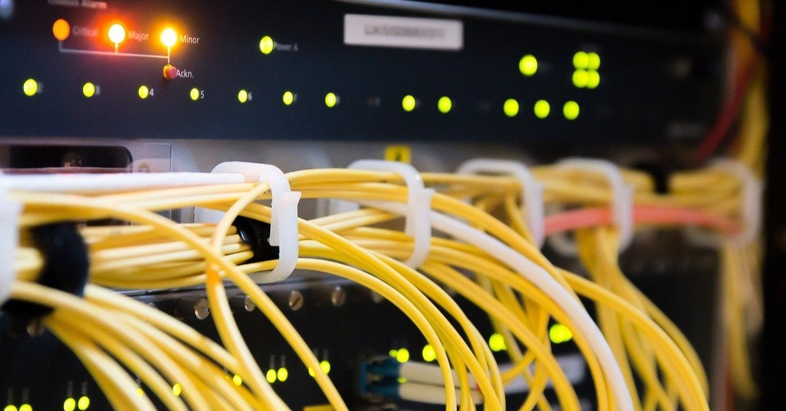

<figure>

</figure>

　自宅でサーバを構築するようになってから20年ぐらいになるだろうか。最初に使ったOSはRed Hat Linuxだったように記憶している。使い古したデスクトップPCにLinuxをインストールし、それを家の外の物置に置いてLANケーブルを家の中まで引っ張って運用していた。その後小型のPCを組み立てて、Fedora Coreをインストールし、すべてのファイルを新サーバに移行した。

　まったくの趣味だったが、Linuxによるサーバ構築がおおよそ理解できたので、その後もいくつかサーバを構築し、最後に使ったOSはCentOSだった。しかし、この辺で突如Linuxでサーバを立てることに飽き、普通のNASを導入している。2008年のブログにLAN HDDのことを書いているから、その頃だろう。

[http://keigox68000.hatenablog.com/entry/20080714/p1](http://keigox68000.hatenablog.com/entry/20080714/p1)

　しかし、これはサーバ構築の手間こそいらないものの、LAN HDD自体の処理速度が遅くて、それが不満だった。ファイルにアクセスするだけなのに、明らかに今までのサーバに比べて重いのには閉口した。LAN HDDってこんなものなのか。

　それで、また自宅サーバを立てることにしたのが2013年。今度はMac miniによるサーバ。MacOS Serverは基本がLinuxではあるが、GUIでほとんどの設定ができるため、非常に楽だった。最初のサーバ導入の後にMacユーザーになっていた事情もあり、今日まで便利に使っている。

[http://keigox68000.hatenablog.com/entry/20130217/p1](http://keigox68000.hatenablog.com/entry/20130217/p1)

　しかし、ここに来て、iPhoneやMacBookをはじめ、アップルのいろいろなサービスから一度離れてみようと思い始めている。NASの少しハイエンドなモデルを導入して、Mac miniは現役引退しよかなと考えているのだ。

　ところが、Mac mini上でApertureというソフトで管理している大量の写真の取り扱いに難儀しているのと、iTunesでアップルロスレスを使って大量に取り込んだ音楽の扱いに困っている。特に写真の方は、Aperture独自のライブラリ形式でファイルを抱き込んでしまっているので、そのままファイルをコピーすればいいという話ではないのが悩みのタネだ。音楽ファイルは、最悪、アップルロスレスのままファイルをコピーしてもなんとかなりそうではある。

　そんなわけで、とりあえずNASを用意することにした。そこに、Mac miniからチマチマと写真を現像して移動していこうと思う。音楽ファイルはベタコピーだな。という計画を立てた。結構時間がかかりそうだ。でも、サーバに保存しているファイルも、合計1TBに満たない程度なので、きっと可能だろう。

　こういう個人で作っているサーバ環境って、特に何かのポリシーがあるわけでもなく、思いつきによるところが大きい。それでもこうやって新しい環境を作ろうとすると、またいろいろ調べるわけで、それがまた楽しくもある。NASは何年も使っていなかったので、現在の潮流はよくわからない。勉強してみよう。よーし、がんばるぞ。
