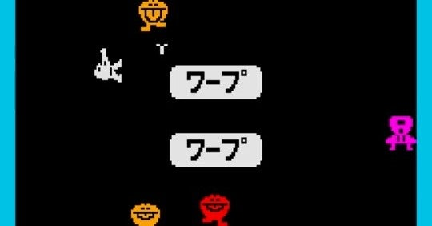

<figure>

</figure>

　『ワープ＆ワープ』はナムコが1981年に世に送り出したアクションシューティングゲームだ。

　プレイヤーは宇宙服のようなものを着た自キャラを操作し、画面の外周を回るように移動しながら迫ってくるエイリアンを銃で撃って倒す。単純明快な内容だ。

　この『ワープ＆ワープ』がユニークだったのは、画面中央にあるワープゾーンを通ることで、まったく別のワールドへ移動できるというゲームシステムを持っていたことである。ゲーム開始時のスペースワールドからワープした先のメイズワールドは、画面が格子状に区切られており、ここではプレイヤーキャラは爆弾を仕掛けることでエイリアンを倒すようになる。フィールドによって2種類の攻撃方法が存在する、当時としては稀有なゲームだった。

　僕が初めて『ワープ＆ワープ』に出会ったのは、隣の市にあったデパートのゲームコーナーである。80年代僕の住んでいた街には、本当にゲームセンターがたくさんあり、思い出して数えただけでも50軒近く営業していた。そんな状況の中、近所のゲーセンで出会わなかったのは不思議である。もしかしたら、出回りの悪いゲームだったのかもしれない。

[https://note.com/keigox68000/n/n96a79eae8882](https://note.com/keigox68000/n/n96a79eae8882)

　近所であまり見かけないゲームというのは、子供心にも希少価値を感じるもので、普段プレイできない『ワープ＆ワープ』を集中的にプレイした。2つのワールドを行き来して戦う独自性と、メイズワールドで爆弾を使って攻撃するという初めての経験が楽しくて、熱中したものである。特に、爆弾の爆風を当てて敵を倒すというシステムは、後に『ボンバーマン』などにも見られて、今となってはごく当たり前の攻撃方法ではあるが、当時は極めて珍しかったのではないか。ちなみに、『ボンバーマン』の元となったハドソンの『爆弾男』は1983年発売だそうだ。

　後に近所のゲーセンでも見かけるようになった『ワープ＆ワープ』だが、その頃には別のゲームに熱中していて、それほど遊ばなくなっていた。ゲームは適切な機会に適切に流通させないと、プレイする機会を失うものなのである。

　1985年には、この『ワープ＆ワープ』をファミコン向けにアレンジ移植された『ワープマン』が発売される。たった4年遅れの移植ではあるが、当時懐かしさを感じてプレイしてみた。ゲームシステムもプレイ感も『ワープ＆ワープ』とほぼ同じというよくできたゲームであったが、僕にとっては、あの低音が特徴的な独特のBGMがアレンジされたことも、単色でシンプルに描かれたかわいらしいエイリアンがカラフルに描き直されたことも、すべてがピンと来なかったのを覚えている。何よりも、画面中央のワープゾーンに表示される「ワープ」の文字がなくなってしまったのは寂しかった。

　ちなみにアーケードゲームの基板を買い始めた頃、思い出の『ワープ＆ワープ』の基板が欲しいと思っていたのだが、ほとんど見ることなく今日まで来てしまった。やっぱり希少だったのかなあ。
