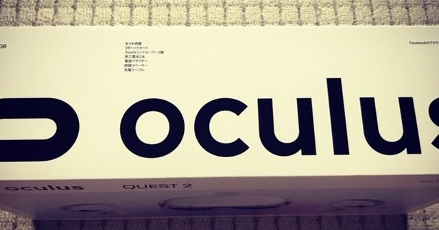

<figure>

</figure>

　VRヘッドセットの新鋭『OCULUS QUEST 2』を買った。いや、買ってしまったというべきか。

　以前、知人の家でPSVRを遊ばせてもらったことがある。そのリアルな映像に驚嘆して、PSVRも欲しいと思っていた時期がある。秋葉原に行くと、店頭でVRヘッドセットをお試しできる店もあり、よく装着してみていた。それだけVRには興味があったということだ。

　しかし、これまで頑なにVRヘッドセットを買わなかったのは、一言で言って「酔うから」である。これは以前にもnoteに記事を書いた。

[https://note.com/keigox68000/n/n01596b93af61](https://note.com/keigox68000/n/n01596b93af61)

　ゲームや映像によるのだが、とにかく酔う。普段車酔いすることなどはないので、これがキツい。それで、すごく興味があるのにあきらめていたのだ。

　じゃあ、今回発売された『OCULUS QUEST2』が酔わないのかと言えば、そんなことはまったくなく、きっとVR酔いするのだろう。しかし、あまりの安さと、先代機種『OCULUS QUEST』から培ってきた、PCなしで完結するすっきりした設計にグラっと来てしまったのだ。ずっと、自分がVRヘッドセットを買わない理由を探して我慢していたのだが、店頭で売っているのを見てダメだった。買ってしまった。

　というわけだ。

　『OCULUS QUEST』は、特定の店舗以外での販売はなかったのだが、『OCULUS QUEST2』はヤマダ電機やゲオなどの、極めて身近な（？）店で売るという作戦に出たのも大きかった。やっぱり、実際に店舗に置いてあるって大事なことなんだな。

　ちなみにゲオで買ったのだが、買うときに店員があれこれ確認してくるのがすごかった。この機械は、この機械の中でソフトを買ってもらうようになるけどいいか。その際はクレジットカードしか使えないけどいいか（実際はPaypalなんかも使える）。ネットワークに繋いで使うけど、家にWi-Fiはあるか。設定するのにスマホが必要だけど、いいか。Facebookのアカウントが必要だけど大丈夫か。もう、あれこれ確認してきた。きっと、「使えないぞ！」って突っ返してくるような事案もあるのだろう。自分も、まさかゲオでVRヘッドセット買う日が来るとは思わなかった。

　とにかく、そんなわけで無事購入した『OCULUS QUEST2』だが、スタンドアロン（まあ、ネットワークには繋ぐのだけど）のVRヘッドセットとは言え、PCに繋いで使うことも可能だし、YouTubeなどのVRコンテンツも見ることができる。ゲーム以外にそういうもの試したいという思いがあって購入した。もちろん、VR内の映像をキャプチャしてYouTubeにアップして残しておこうという気もある。買ったら買ったで、いろいろ遊んでみたいとは思っていた。しかし、そのためにはいろいろと設定が必要なようだ。

　ネットに情報はあふれていて困ることはなさそうだけど、これはよくわからないで買うと敷居の高いデバイスかもしれない。そんなことを思いながら、初日は本体をアップデートして、録画するための設定をして、いくつかのデモ版を試して終わってしまった。最後に『ホームスターVR』だけ買ってみて、星を見ながら寝ようと思った。けど、ヘッドセット外さないと寝られないよな。

　またいろいろ書きたい。
