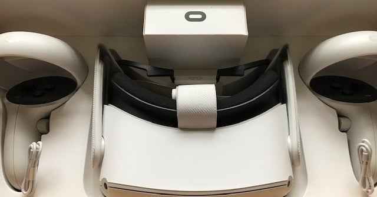

<figure>

</figure>

**※今回の記事は僕自身がやったことの記録です。なんら動作保証等はなく、また記事の設定を推奨するものではありません。**

　『OCULUS QUEST2』を買って、やりたかったのはとにかく映像をキャプチャすること。これは、後にVRで見れなくてもよい。普通の映像で保存できればいいというつもりだ。どちらかと言えば、YouTubeにアップして、普通のPCで見られるような映像でいいということだ。

## １．PCに接続したOculus Quest 2からファイルを取り出したい

　とりあえず、Oculus Quest 2本体から録画（またはスクリーンショット）はできることがわかった。録画ボタンは、共有メニューの中にある。ところが、これで録画しても、デフォルト状態ではFacebookに投稿できるだけだ。なんとかしてPCに動画データを読み込みたい。我が家の環境では、PCにADBドライバを入れる必要があった。

[https://vworld-edge.com/sidequest/#toc\_id\_3](https://vworld-edge.com/sidequest/#toc_id_3)

　また、ADBドライバを入れた後は、Oculus Quest 2本体の開発者モードをオンにする必要がある。初回は、このときに開発者情報を入力する必要もある。上記サイトを参考にすれば特に問題なく行える。

　PCとOculus Quest 2を接続すると、USBデバッグの許可を求められるが、これも許可する。これで、エクスプローラーからOculus Quest 2を開いて、その中のファイルをPCに引っ張ってこれるようになった。

## ２．Oculus Quest 2本体で録画する際の解像度やフレームレート、ビットレートを変更したい

　なぜかOculus Quest 2の録画機能で保存した動画は正方形をしている。これについては、上記サイトのSideQuestというソフトを利用すると、Oculus Quest 2本体のUIには存在しない設定もいじることができる。とりあえずこれで、1920x1080の解像度で録画できるようにした。

[https://vworld-edge.com/capture/](https://vworld-edge.com/capture/)

　また、同時に、録画のフレームレートを30fps→60fpsに、動画のビットレートも変更できるようだ。ビットレートを選択する項目「Set FFR」は、LOWにしてみた。録画されたファイルを確認したところ、5Mbpsぐらいで記録されている。しかし、動きの激しい『BEAT SABER』では、結構ブロックノイズが目立つので、こちらについては少し調整してみたい。

[https://www.youtube.com/watch?v=1z7YkLt5Wb8](https://www.youtube.com/watch?v=1z7YkLt5Wb8)

## ３．ソフトが録画制限している場合

　これで一応フルHDのサイズでゲームをキャプチャできると安心したものの、そうは問屋がおろさない。『BEAT SABER』はOculus Quest 2本体で録画できるのだが、『Kizuna AI - Touch the Beat!』はソフト側で録画を制限しているので、まったくキャプチャできない。

　ソフトが録画制限しているのをキャプチャしちゃうのはどうなのって話は置いといて、それでもなんとかしてみたい。ちなみにこのゲーム、Vtuberを使った安易なキャラゲーかと思っていた（失礼）が、ペンライトを振ってアイドルを応援するというムーブと、音ゲーのシステムがうまくマッチしていて面白い。DEMOでは２曲しか遊べないが、曲数が多ければ結構楽しめそうだ。

　というわけで、単純にiPad ProにOculus Quest 2の画面をミラーリングしてみた。これをiPad側でキャプチャすれば、（フレームレートとかの問題は後で考えるとして）動画ファイルができるのではないか。

　結論から言うと、録画はあっけなくできた。ところが、ミラーリングの映像には音が入っていない。そう言えば、確かにiPadから音は出てない。どうやら、ミラーリングで音は出ない仕様のようだ。

[https://twitter.com/keigox68000/status/1318302408389226496](https://twitter.com/keigox68000/status/1318302408389226496)

　こちらも調べてみて、いくつか情報があったのだが、はっきりとしない部分も多い。ChromeCast（やFireStick）では音声も含めてミラーリングできるという情報もある。しかし、それだけのためにChromeCastを買って試すのはバカバカしい。そもそもChromeCastの映像はHDMIキャプチャで取り込めるのか。HDCPの制限がかかっていそうで面倒な予感がする。

　しかし、どうやら最初に導入したSideQuestを使えば、PCに対してミラーリングができるようだ。次回はこちらを試してみよう。
