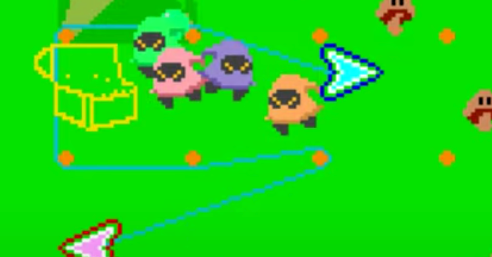

<figure>

</figure>

　『リブルラブル』はナムコが1983年にリリースしたアーケードゲームだ。2本のレバーで、リブルとラブルというキャラクターを操り、2つのキャラクターを結んだ線でフィールドを囲んで敵を倒したり、宝を見つけたりするゲームだ。初期のナムコらしい、他には見られない斬新なゲームシステムが印象的なゲームだった。

　『リブルラブル』を最初に見たのは、当時よく通っていたゲーセン、シルバーコインだった。（シルバーコインについては過去の記事にて紹介）

[https://note.com/keigox68000/n/nd3a3438a427f](https://note.com/keigox68000/n/nd3a3438a427f)

  

　薄暗い店内に、緑色に輝く画面が鮮やかだった。新製品ということもあり、店に入ってすぐの場所に置いてあるテーブル筐体で稼働していた。新製品ゲームのインストカードを読んでいた僕に、ゲーセンの店長が話しかけてきた。「それ、今日入荷したんだよ。おもしろいからやってみて」

　言われなくてもナムコの新製品とあれば遊ばないわけにはいかない。基本的なルールを把握して、早速100円を投入してみる。ゲームの最初に、今で言うチュートリアルにあたる操作をやらされる。リブルとラブルでゴム紐のように伸びるラインを張り巡らし、宝の位置を示す場所を囲むのだ。

　しかし、ルールは単純でも、操作が難しい。両手で別の動きをするというのが、なかなか思うようにいかないのだ。一応、左右にレバーが付いているゲームとしては、それまでにニチブツの『クレイジークライマー』を経験していた。しかし、あちらは2本のレバーをひたすら上下に動かすようなゲームで、『リブルラブル』のように上下左右に縦横無尽に動き回るゲームはなかった。特に、リブルとラブルの左右が入れ替わると、途端に操作の難易度が跳ね上がる。一筋縄ではいかないゲームだった。

　ゲームのフィールド上には、杭に見立てたドットが配置され、これにリブルとラブルをつなぐ紐（？）を引っかけて、敵や宝箱をうまく囲むというギミックも新しかった。杭に紐を絡ませる様子が、実にリアルで楽しかった。ナムコのゲームは本当に凄いと思った。

　『リブルラブル』には、隠された宝箱から現れる妖精を紐で囲んで捕らえ、キーワードを揃えるとボーナスステージに突入するというフィーチャがあった。その際に流れるBGMがこれまた印象的だった。牧歌的なメロディながら軽快で、ボーナスステージの楽しさを表現したかのような音楽だった。

　ボーナスステージは、フィールド上に隠された６つの宝箱を囲んで探し出すゲームを行う。ステージ開始時に一瞬だけ表示される宝箱の位置を一気の覚えなければならず、これも難しかった。中には賢い人がいて、ボーナスステージになった瞬間に、宝箱の場所に10円玉を素早く置いていた。なるほどいいアイデアだと思った。テーブル筐体全盛の時代ならではのエピソードである。

　しかし、この10円玉を置く作戦は、テーブル筐体のガラスが傷つくという理由で、後に禁止されていた。なるほど、そりゃそうだ。ナムコが、「バシシマーカー」という、厚紙を切り抜いて使用する、10円玉の代わりのマーキンググッズを配布したりしていたのも、こうしたゲーセンの事情を汲み取ってのことだったのかもしれない。

　独創的なゲームシステムと、ナムコならではファンタジックなヴィジュアル、印象的な音楽が彩るアートのような作品。それが、僕の『リブルラブル』に対する印象だ。このイメージは今も変わっていない。またどこかで遊びたいなあ。

[https://www.youtube.com/watch?v=2WZbOBr4jPM](https://www.youtube.com/watch?v=2WZbOBr4jPM)
