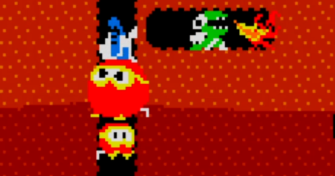

<figure>

</figure>

　『ディグダグ』はナムコが1982年に発売したアーケードゲーム。横から見た地層の断面図のような画面構成で、穴を掘りながら地中に生息する怪獣を倒すアクションゲームだ。

　なんと言っても、主人公のディグダグが、怪獣を倒すためにポンプを使うというのが楽しかった。怪獣に向かってボタンを押すとホースの付いた銛を発射する。怪獣に銛が突き刺さったら、そのままボタンを押す。すると怪獣の体は膨らみ、哀れ破裂して死亡するのだ。こんなゲームはそれまで見たことがなかった。

　怪獣が膨らむのも楽しかったが、地面の下に穴を掘るという行為そのものも、なんだかワクワクした。地底を探検しているようなその雰囲気が、僕の冒険心を刺激したものだ。地中には、ところどころに岩が埋まっていて、その下を掘ることでこの岩を落下させ、これもプレイヤーの攻撃手段となった。

　怪獣たちは丸い体のプーカァ、火を吐くファイガーの２種類が存在した。たった２種類というシンプルさが、研ぎ澄まされたゲームデザインの妙を感じさせる。こういうところが当時のナムコのすごいところだ。怪獣と書くと怖いが、キャラクターが実に可愛らしいのも印象的だ。もう、見た目におもしろそう！　と思わされるゲームだったのだ。

　最初から、ゲーム少年たちの食いつきがよかった『ディグダグ』だが、このゲームはさらに奥深い魅力を秘めていた。岩を落下させて攻撃する際に、なるべく多くの怪獣を倒すと、点数が飛躍的にアップする。銛を刺して怪獣を膨らませる際に、歩きながらボタンを押すと素早く攻撃できる。怪獣を膨らませることを中断することで、その後ろをすり抜けて移動できる。などなど、小さなゲーム仕様上のテクニックが数多く仕込まれていたのだ。これらのテクニックが発見されることで、ゲームプレイはさらに熱くなった。特に、パターンを作り出すのが得意なプレイヤーにとっては、小テクニックと怪獣たちの移動パターンを組み合わせることで、高得点を叩き出すことに成功していた。実に攻略しがいのある作品だったのだ。

　後にファミコンやパソコンにも移植され、様々なプラットフォームでプレイできるようになった『ディグダグ』。シンプルなシステムながら、見た目の魅力と奥深いゲーム性を兼ね備える、当時のナムコらしい、いや、当時のナムコの中でも稀有な名作ゲームだったのではないか。ゲーセンでも、長い期間稼働してたように思う。蛇足だが、『ジグザグ』なんてコピー基板も存在し、こちらも数多く稼働していた辺りにも、『ディグダグ』の人気のほどがうかがえる。

　後年、PS4などでも移植で『ディグダグ』が遊べるようになったが、「全ての地面を掘りつくせ！」などという無茶振りとも思えるトロフィーを獲得するぐらい遊んでしまった。青春の思い出が、臆面もなく蘇ってしまったのかもしれない。
