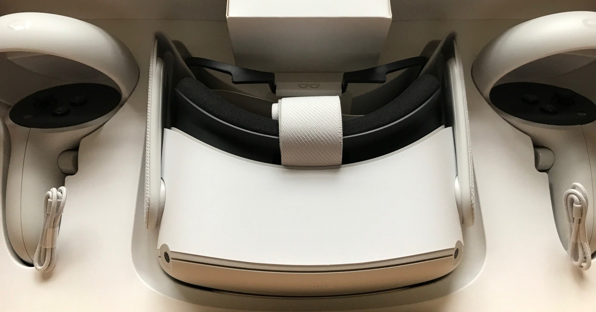

<figure>

</figure>

　引き続きOculus Quest2でいろいろ試している。その後実際にやったことを箇条書きで記しておこう。

・PCでのミラーリングも成功。無線でミラーリングもできるのだが、そのためには一旦USBで優先接続して設定が必要。以下のサイトが参考になった。ただし、PCによるミラーリングの場合も音は出ない。

[https://urashita.com/archives/31142](https://urashita.com/archives/31142)

・Oculus Linkを使って、PC用のVRヘッドセットして使用可能。PCにOculus Linkのソフトをインストールする。Oculus Quest2とPCの接続はい一応USB2.0でも可能だったが、USB3.0推奨らしい。最初Oculus Linkが立ち上がってこなかったが、PCとOculus Quest2を再起動、USBのコネクタを変更などやったら認識した。USB2.0ではちょっと不安定なのかもしれない。以下は参考URL。

[https://gumin-ch.com/oculus-link-setting/](https://gumin-ch.com/oculus-link-setting/)

・Oculus Linkを使用した上で、Steam VRをインストールすることで、Steamで配布されているVR対応ソフトを動かすことができる。

・SideQuestで、Oculus Quest2内の録画ビットレートを変更できる。試しに5Mbps程度で録画してみたが、思ったよりブロックノイズっぽい感じで汚い。ベータ機能（？）のリフレッシュレート90Hzを選択しているので、よくよく考えたら、普段PCで録画している60FPS動画の1.5倍の情報量ってことになるのか。ただし、あまりビットレートを上げると、録画中に動作が重くなるという記事もあり。これは今後も継続調査したい。

[https://www.youtube.com/watch?v=8bsMzqh4jek](https://www.youtube.com/watch?v=8bsMzqh4jek)

　そんなわけで、いろいろ楽しんでいるOculus Quest2であるが、ソフトによってVR酔いする／しないの差が激しい。これには個人差があるので、参考にはならないが、試したソフトを列記しておこう。

> ・**BEAT SABER**　まったく酔わない  
> ・**ホームスターVR**　まったく酔わない  
> ・**The Walking Dead: Saints & Sinners**　結構酔う。最初のチュートリアルの移動でダメだった  
> ・**スペースチャンネル5 VR あらかた ダンシングショー**　まったく酔わない  
> ・**Kizuna AI – Touch the Beat!**　まったく酔わない  
> ・**Google Earth VR（Steam）**　3Dの地表ビューで移動すると若干気持ち悪い  
> ・**AIRCAR（Steam）**　Steamで無料だった、架空の都市上空をスピナーみたいな飛行機で自由に飛び回るソフト。**ものすごく酔う  
> **・**YouTubeにある360°動画**　ほとんど酔わない

　非常にわかりやすいのだが、自分で操作して移動するソフトは気持ち悪くなるようだ。特に、頭を回して回転するような動きが気持ち悪い。それにしても、設定とかPCでの利用ばかりやっていて、肝心のゲームがあまりプレイできていない。ここらでそろそろ本腰を入れてゲームをやりたい。とりあえず、『Rez Infinite』が酔うのか酔わないのか気になっている。
