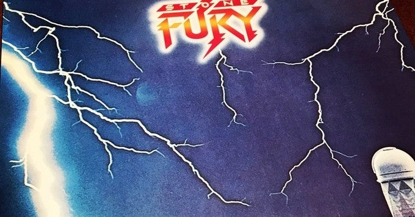

<figure>

</figure>

　あんまり家でじっくり音楽を聞かなくなって久しい。レコードは明らかに取り扱いが面倒なのだが、それでも好きなアルバムが安く置いてあるのを見かけると買っている。

　別にコレクターではないので、好きなアーティストのアルバムをコンプリートしたり、レーベルにこだわって買ったりはしない。もっと言えば、若干盤面の状態がよくなくても気にしていない。

　そんな感じでもレコードを買うのは、自宅でCDを聞く環境が以外にも早くなくなってしまったせいかもしれない。

　ところで、今回買ってきたレコードを紹介しよう。突然の流れだが。

BURNS LIKE A STAR / STONE FURY  
　後に、KINGDOM COMEでLED ZEPPELINのパクり批判を受けることになってしまうヴォーカリスト レニー・ウルフが結成したバンド。サウンドはメロディアス、ポップで耳に残りやすい。名曲揃いのいいアルバム。

[https://www.youtube.com/watch?v=TV6VyEPHJgQ](https://www.youtube.com/watch?v=TV6VyEPHJgQ)

NO PAROLE FROM ROCK 'N' ROLL / ALCATRAZZ  
　伊藤政則による帯のアオリ「泣くがいい。声をあげて泣くがいい。」が名コピーと言われたアナログ盤。ついに帯付きで手に入れた。アルバムの中身はもう言うまでもなく名盤。素晴らしいアルバムだ。  

[https://www.youtube.com/watch?v=L5\_CqMGsE7E](https://www.youtube.com/watch?v=L5_CqMGsE7E)

HEAR "N AID / STARS  
　アフリカ飢餓救済の目的でメタル関連のアーティストが集まって録音された、暑苦しいチャリティソング。CDは持っていたのだけど手放してしまった。ジャケットは集まったメンバー写真のもあるらしいけど、これはどういう盤なのだろう。

[https://www.youtube.com/watch?v=G5H94GHb-10](https://www.youtube.com/watch?v=G5H94GHb-10)

VIENNA / ULTRAVOX  
　ミッジ・ユーロ加入後のエレクトロ・ポップ／ロックなULTRAVOXの名盤。シンセをダイナミックにフィーチャしたサウンドメイキングもさることながら、ドラマティックで大仰な曲に惹かれる。

[https://www.youtube.com/watch?v=cv4nnmqfEuQ](https://www.youtube.com/watch?v=cv4nnmqfEuQ)

　ターンテーブルに乗せるのが楽しみだ。
