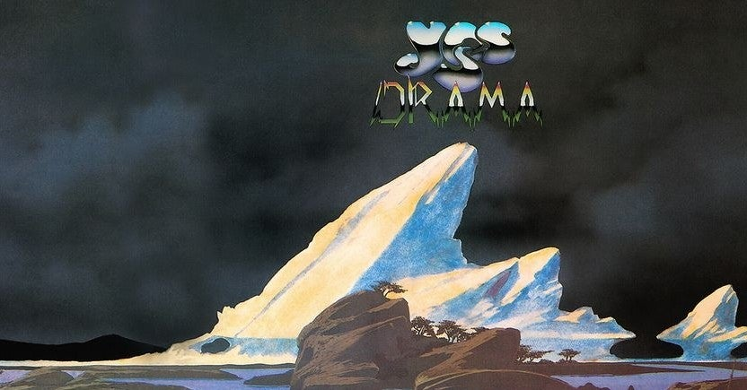

<figure>

</figure>

　YESの『DRAMA』は、物議を醸したアルバムだ。ジョン・アンダーソンとリック・ウェイクマンが脱退し、代わりにBUGGLESのトレヴァー・ホーンとジェフ・ダウンズが加入したのだから当然といえば当然だ。

　しかし、僕はその当時の騒動をリアルタイムでは知らない。さらに、BUGGLESのアルバムはそのポップセンスを非常に買っている。そんなわけで、このYESの問題作『DRAMA』を実にいいアルバムだと思っている。

　プログレというよりは、ハードロックに近いヘヴィなサウンドで幕を開けるアルバム。YESらしいサウンドを持ちながら、新しい時代の音を取り入れた新鮮な展開がそこにはある。

[https://www.youtube.com/watch?v=dXsFByRJsos](https://www.youtube.com/watch?v=dXsFByRJsos)

　スティーブ・ハウのギターは、1980年という時代を考えると、極めてフラッシーで刺激的なプレイを聞かせてくれる。ギターサウンド好きにもかなりアピールするソロを聞くことができる。

　それでいて、随所で光るBUGGLESを彷彿とさせるポップセンス。この、プログレとメロディポップの間を行くような楽曲が、このアルバム最大の武器と言えるのではないか。今、先入観無しで聞いても、十分に楽しめるアルバムに仕上がっている。

　しかし、当時熱心なYESファンがこれを受け入れられなかったのは当然だ。それは仕方ない。音楽シーンの変遷と、メンバーのそれに対する反応が、運悪くメンバー脱退の方向に動いてしまったからだ。

　ミュージシャンはいつでも、自身の音楽と、シーンの趨勢に敏感だ。彼らのプレイしたい音楽に、ファンがいつでも柔軟についていけるとは限らない。その結果として、クォリティの高いアルバムであっても、嗜好の問題から受け入れられなければ、その時点では駄作扱いだ。これが難しい。

　だから僕は、時間が経ってから再評価のために古いアルバムも聞いてみようと思う。後から聞けば意外に受け入れられるものもたくさんある。自分の柔軟さも増して、新たな発見ができる。そういう音楽の聞き方をしてみたい。

[https://www.youtube.com/watch?v=UlwsV6d6P1c](https://www.youtube.com/watch?v=UlwsV6d6P1c)
