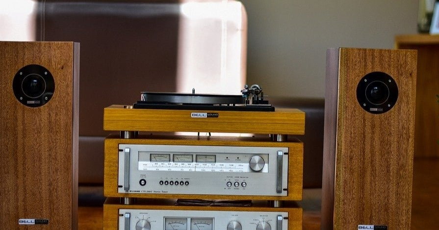

<figure>

</figure>

　最近は音楽を聞くのにもブルートゥーススピーカーを使うことが多い。スマホでもパソコンでも、無線で迫力のサウンドが再生できるのだから、こんんなに便利なものはない。

　ところが、ブルートゥーススピーカーが普及し始めてから、圧倒的に失われたのがステレオ感だ。ブルートゥーススピーカーの多くが、コンパクトさを優先するあまり、左右にスピーカーを配置してステレオ感を出すことを放棄してしまっている。

　もちろん、中には左右のスピーカーから別々に音を出して、ステレオ感を出しているブルートゥーススピーカーも存在する。しかし、今や多くのスピーカーがステレオであることを放棄してしまったのだ。

　80年代は、マイホームにオーディオセットを設置することがひとつのステータスであり、後のピュアオーディオと呼ばれる巨大なオーディオから、流行りに流行ったコンポのようなリビングの棚に収まりのよいオーディオセットまで、本当に様々に音楽を聞ける環境があった。もっと言えば、「ステレオ」という言葉は本来の意味を離れ、音楽を聞く機械そのものを指していた。

　しかし、今はそういうものがすでに死に絶えた世界。オーディオ自体が一部マニアの高級な趣味となり、よほど好きな者でもない限り、巨大なオーディオセットを揃えようなどとは思わないのだ。

　そんなわけで、僕の部屋にもオーディオセット、コンポの類いはない。レコードプレーヤーで音楽を聞くことはあるが、聞いているスピーカーはPC用を流用している。かろうじてステレオだが、オーディオマニアからすれば笑っちゃうような陳腐な設備である。

　ブルートゥーススピーカーが一般化したことで、ステレオ感が失われ、こんなにもオーディオの世界が狭まるとは思わなかった。一時期は、ホームシアターなどと言って、スピーカーの数が無限に増えるようなムーブメントさえあったというのに、もはや隔世の感すらある。現代においてステレオ効果の生きている環境は、FPSなどで使われているゲーミングヘッドセットだけではないかとさえ思ってしまう。

　かようにステレオ感のない世界。なんとも寂しい感じはする。
