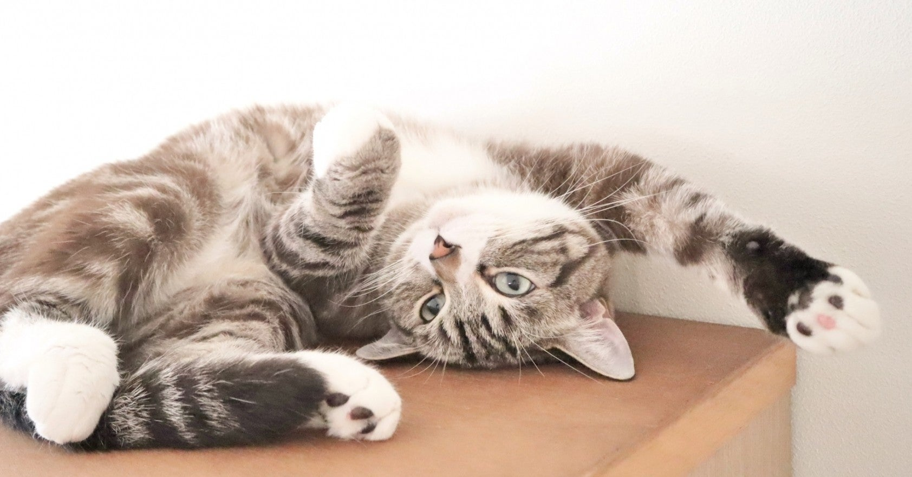

<figure>

</figure>

　もうびっくりである。まさかの『真・女神転生III NOCTURNE HD REMASTER』が、がっかり移植だったとは。

　画面もHD化してあり、一見して良好なリバイバル移植のように思えるのだが、実はメニュー画面などで仲間にした悪魔を表示しようとすると、そのデータの読み込みに1秒ほどかかり、そのためにゲームのテンポが悪くなっている。1秒ぐらいどうってことないような気がするかもしれないが、頻繁に表示するところなので、ここが遅いと非常にストレスがたまる。結果、世間の評判は悪い。

　同時に、みんなの期待度が高いゲームだったということもあり、今回は不満が噴出してしまっているようだ。まさかPS2のオリジナルよりゲームのテンポが悪くなるとは思わなかった。今のゲームの移植ってこんな程度の技術力なのかな、と思わずにはいられない。そのうち直してくれるといいな。

　残念な移植というと、過去にいくつか例があり、今回の『真・女神転生』みたいな例を見るたびにそれらが思い出される。

　一番強烈だったのは、Xbox360の『怒首領蜂大往生 ブラックレーベル EXTRA』だ。ロード時間が異常に長く、決定／キャンセルボタンがゲーム内で統一されていない。難易度調整のバランスが取られていない。などなど、あまりに雑な移植だった上、ゲーム本体のソースはPS2版を盗用していたというオチまで付いて、移植ゲーム界のダメなところを結集したようなソフトになっていた。これはその後、1年近くをかけてアップデートがされたが、それでも修正されていないところがいっぱいあって、僕の中では、結局クソ移植のまま捨てられたゲームという印象が強い。

　少し前には、任天堂スイッチ用の『ナムコミュージアム』が、入力遅延があまりにひどいという残念な移植があった。こちらも、その後アップデートが入ったようであるが、あまり劇的には改善していない。これについては、ディレクターから直りません宣言も出てしまい、クソ移植として歴史上に固定された感がある。

[https://twitter.com/Tagotch/status/912876798509060097](https://twitter.com/Tagotch/status/912876798509060097)

　世の中には、びっくりするぐらい素晴らしい再現度で過去のゲームを、今のゲーム機に移植する例もある一方、こういういい加減な移植、商売がまかり通っているのも事実である。単に、懐かしいゲームをコレクションとして手元に残しておきたいのなら、それっぽい画面（と音）さえ出ていればいいのかもしれない。しかし、こっちはしっかりプレイをしたいのだ。きちんと遊べるものを出してほしい。

　これは、過去の偉大なる作品を保存するという動きにも繋がる。僕は常日頃、原作に忠実な移植作品は、移植として再現することが可能なゲームという媒体を、後世に残していくという意味合いもあると考えている。だから、移植ゲームには、その完成度にこだわってほしいのだ。

　こういうことがあると、レトロブームなんてものの薄っぺらさを感じてしまうし、なんとも残念な気持ちにならざるを得ない。幸い今は、ネットワークを通じてリリース後の修正が効く時代だ。それを見越して未完成のものを見切り発車されるのはたまらないが、まだチャンスは残されていると見て、何か改善されることを望む。切に望む。
