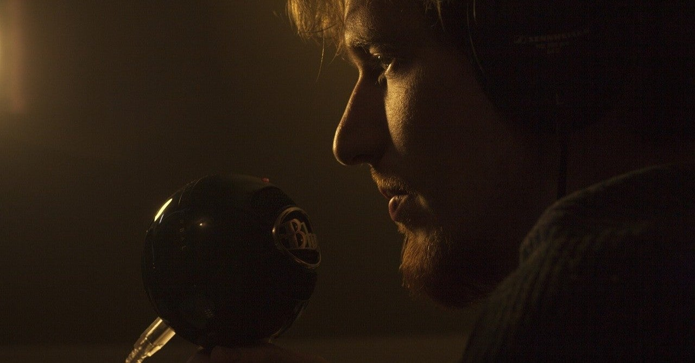

<figure>

</figure>

　唐突に、ゲームニュースを読んで、その感想を言う配信を始めてみた。ゲームプレイも何もなく、ただ雑感をしゃべるだけだ。

　世の中に、ニュースの解説や雑感を話している動画って意外に多くて、普段そういうのをおもしろいなと思ってみていた。そのうち、自分でもやってみたいような気がしてきた。ゲームニュースに限って感想を言ってみるか。

　そんな感じで一発録音してアップした。引用する映像をつけるのはちょっと手間がかかるが、しゃべる方はいつもの勢いで一気にしゃべることができた。あらかじめ、どのニュースについて感想を述べるか。それは決めているので、その段階でこういう内容を話そうぐらいの構想は持っている。しかし、原稿やリハーサルはない。時間のかかることをやると、継続できないので、極めてシンプルに始めてみたわけだ。

　後から聞いてみると、噛んでいたり、勘違いで物を言っていたり、いろいろと間違いはあるのだが、その辺りはあまり気にせず、訂正はテロップで行うことにした。

　時間的には10分以内に収めたいと考えているのだが、いつも終わってみると12分ぐらいになっている。ちょっとしゃべりすぎかもしれない。なにか話せと言われると、話す内容はその場で次々に出てくるが、できる限りシンプルに、短時間でまとめるというのはやはり難しい。YouTubeなどで短く要点を絞ってしゃべっている人は上手いなあと思う。

　まあ、そんなことを考えながら始めてみたので、しばらくいろいろしゃべってみよう。書くのと似ていて、いろいろなことを思いついたように自由にしゃべるのは楽しいものだ。短くまとめるのが難しいところまで似ている。

[https://www.youtube.com/watch?v=aIkQLM\_9lx0](https://www.youtube.com/watch?v=aIkQLM_9lx0)
