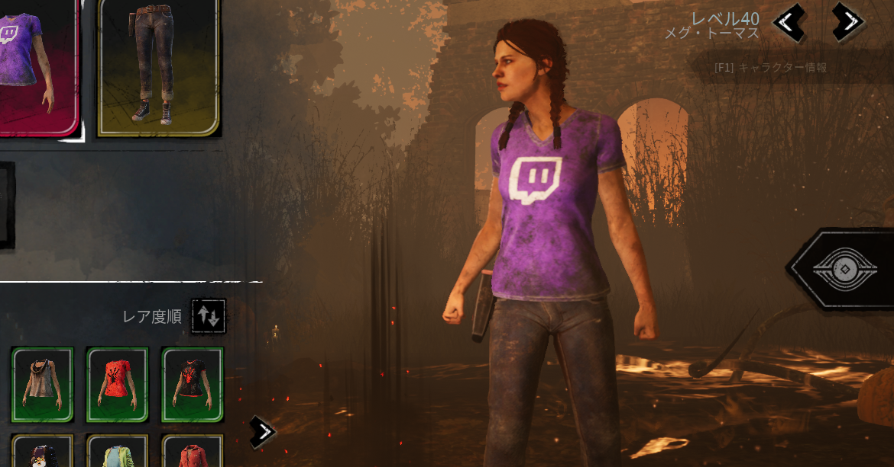
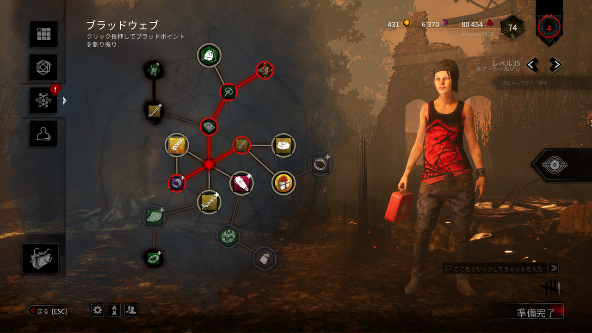

<figure>

</figure>

　そんなのいつものことじゃん。それが今回のはかなりすごいらしい。

　まず、特定配信者にのみ配布される予定だったスキンが、全員に配られてしまっているらしい。何かのイベントで使う予定だったのだろうか。ドワイトやメグはTwitchのシャツを着ていて、これはこれで欲しいくらいだ。ちなみに、次のアップデートで回収するらしい。それぐらいプレゼントしてよ。しかし、なぜか僕のところには来ていない。二重のバグでショックが大きい。

　さらにSNSなどでは、キャラクターを含めたフィールド上のオブジェクトが真っ黒になるバグ、ロード画面から抜け出せないバグ、透明なキラーに担がれるバグ、スキルチェックなどが表示されないバグ、トーテムが壊せないバグ、マップ上オブジェクトにキャラクターが突き刺さるバグ。なんだ、いつも通りじゃん、という感じがしなくもないが、これだけまとめて噴出したのは初めてじゃないだろうか。もう『デッドバイデイライト』はバグの総合商社だ。

[https://twitter.com/lostgamejp/status/1323495937650552833](https://twitter.com/lostgamejp/status/1323495937650552833)

[https://twitter.com/s\_y\_u\_u\_u\_u\_/status/1322989950560686080](https://twitter.com/s_y_u_u_u_u_/status/1322989950560686080)

[https://twitter.com/sky\_motoya\_chop/status/1323017370231730176](https://twitter.com/sky_motoya_chop/status/1323017370231730176)

　あまりに楽しいので、限定スキンで１プレイ動画を録画したのでそのうちアップしておこうと思う。

　ちなみに、うちの奥さんは、買ってないすべてのキャラクターが開放されるという素敵なバグに遭遇している。これ、直さないでほしいぐらいだよね。

　運営はしっかりしてくれー

