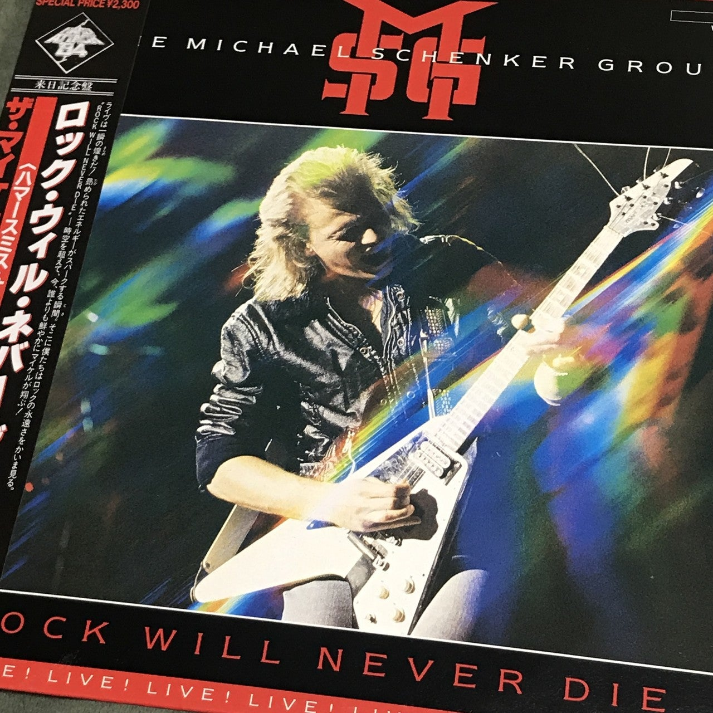
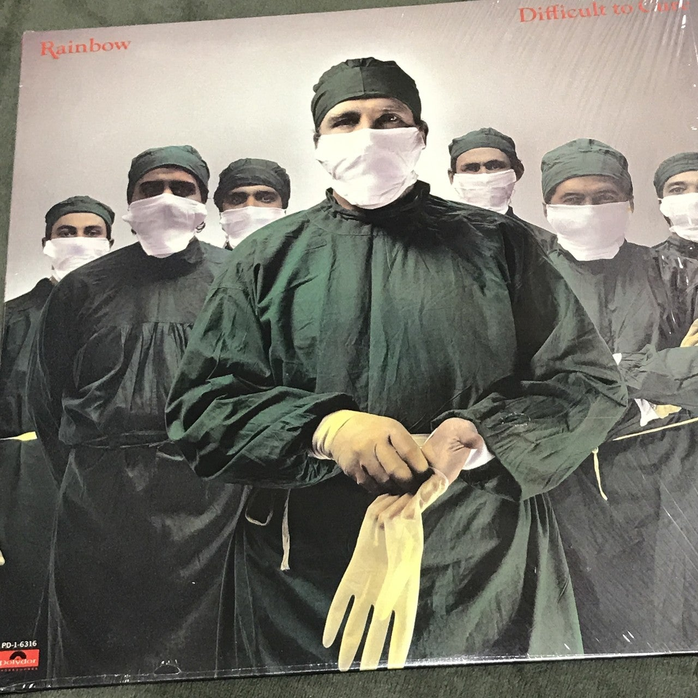
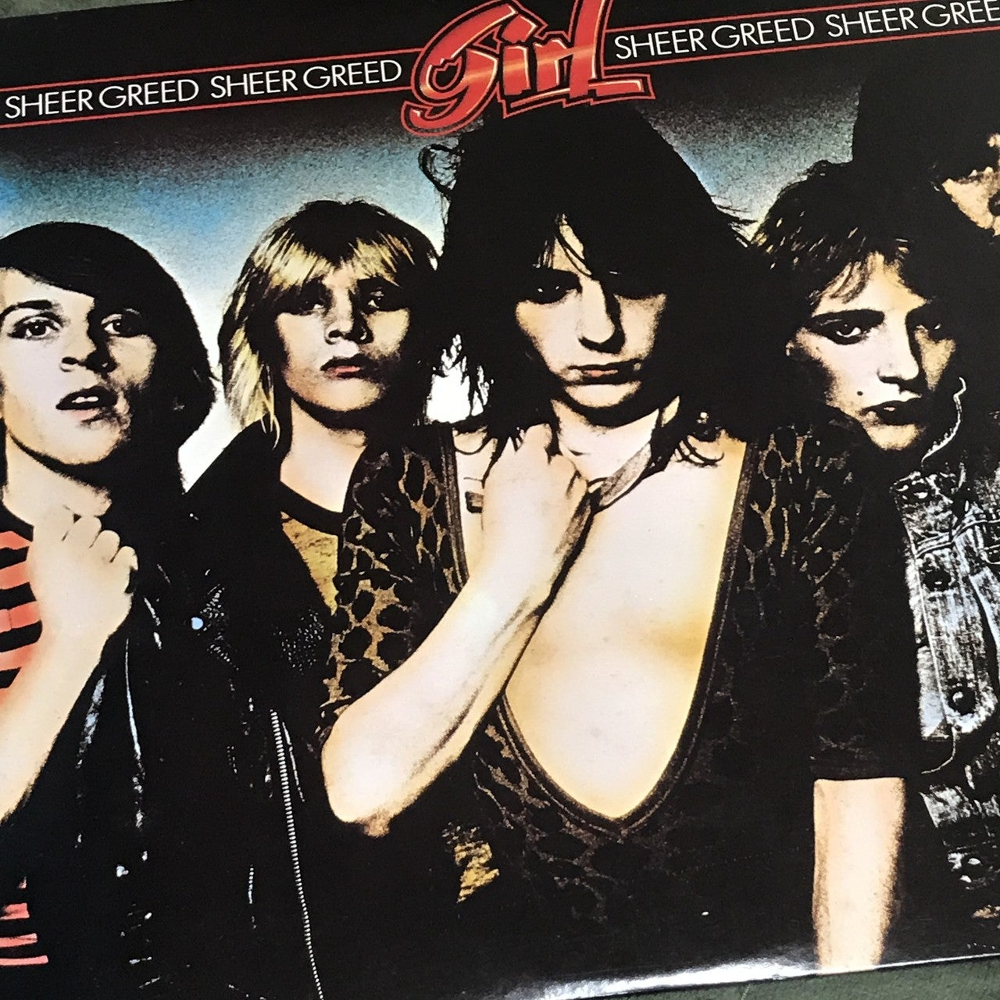
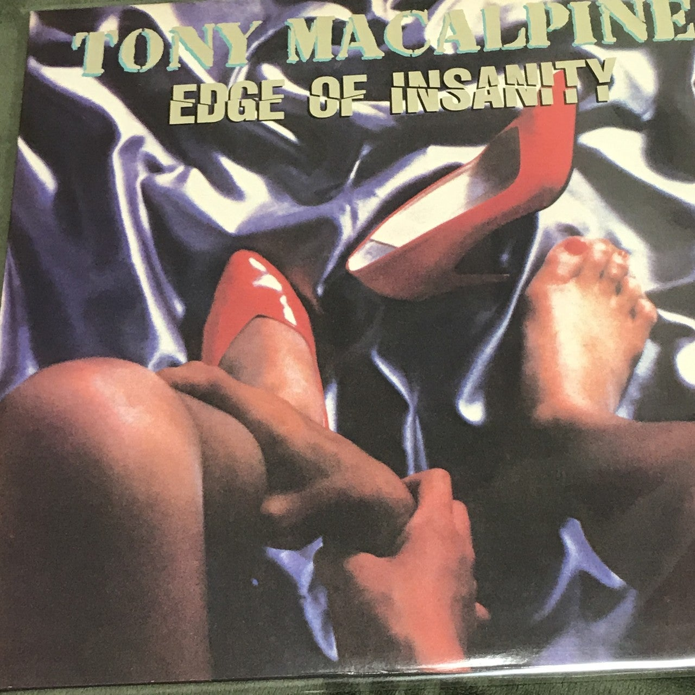
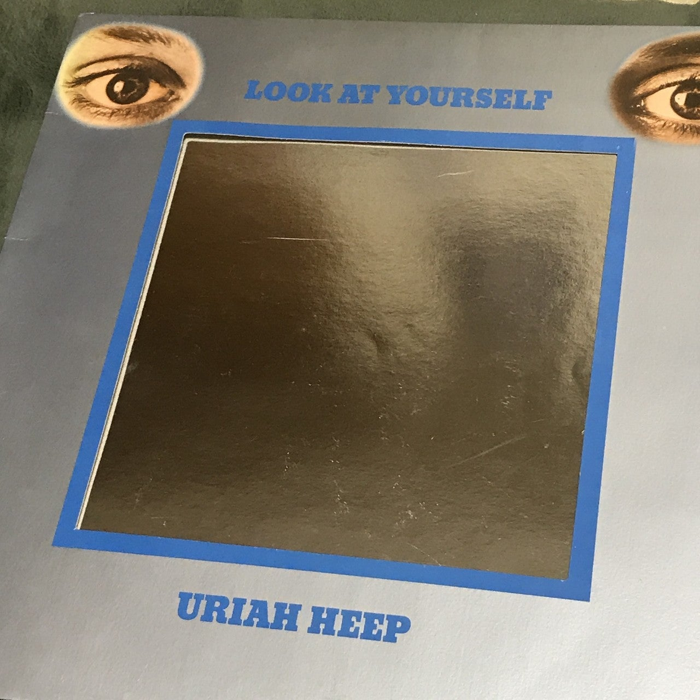
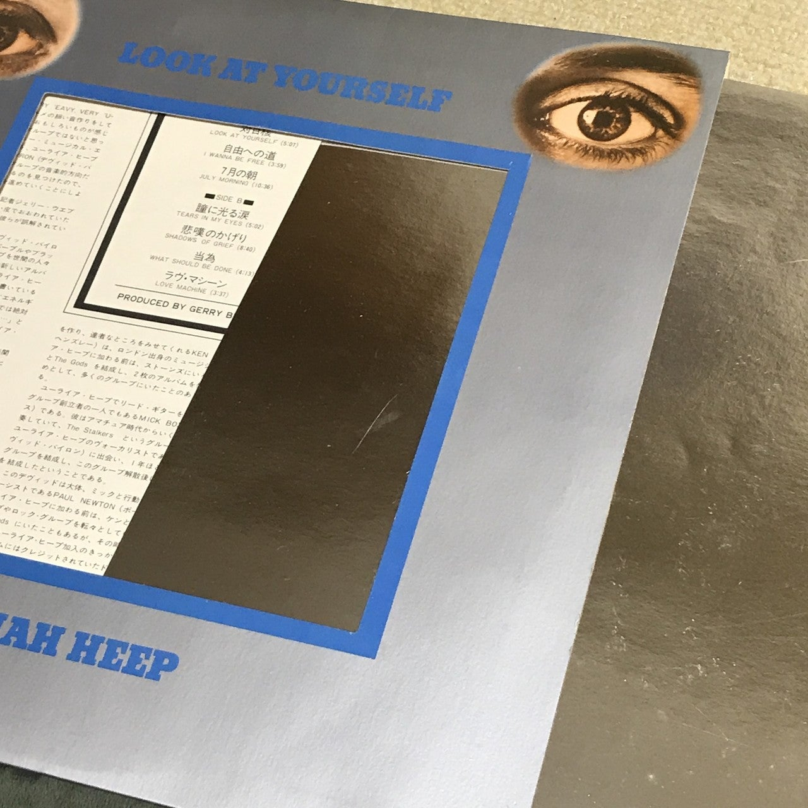

<figure>

</figure>

## ROCK WILL NEVER DIE / MICHAEL SCHENKER

　1983年ハマースミスオデオンのライブを音源とするアルバム。昔、このライブの映像をLDで買って繰り返し見ていた。ゲイリー・バーデンとデレク・セント・ホームズのヴォーカルの差がありありとわかったり、ラストの"Doctor, Doctor"でクラウス・マイネが飛び入りで参加して、これがまた歌うまかったり。楽しいライブアルバムだ。

[https://www.youtube.com/watch?v=sBAJg9NdU3o](https://www.youtube.com/watch?v=sBAJg9NdU3o)

## DIFFICULT TO CURE / RAINBOW

　以前noteに記事も書いたアルバム。ポップとハードの間を行く絶妙な完成度の一作。

[https://note.com/keigox68000/n/n03a83221fb94](https://note.com/keigox68000/n/n03a83221fb94)

[https://www.youtube.com/watch?v=iMmMqfQZkxA](https://www.youtube.com/watch?v=iMmMqfQZkxA)

## SHEER GREED / GIRL

　デフ・レパードのフィル・コリンと、L.A.ガンズのフィリッップ・ルイスが在籍したバンド。1980年のリリースということで、NWOBHMみたいなグラムロックみたいな、ノリのいいロックンロールだ。

[https://www.youtube.com/watch?v=\_DNyjzpDn9o](https://www.youtube.com/watch?v=_DNyjzpDn9o)

## EDGE OF INSANITY / TONY MACALPINE

　トニー・マカパインのネオクラシカルなインストがもっとも楽しめる1stアルバム。オープニングを飾る"Wheels of Fortune"のインパクトはすごい。

[https://www.youtube.com/watch?v=bYTY3DxMEnY](https://www.youtube.com/watch?v=bYTY3DxMEnY)

## LOOK AT YOURSELF / URIAH HEEP

　先日記事を書いたユーライア・ヒープのアルバム。説明の必要もないんだけど、鏡を模した特殊ジャケットは、レコードならでは。

[https://www.youtube.com/watch?v=IuKBkYumXZk](https://www.youtube.com/watch?v=IuKBkYumXZk)
