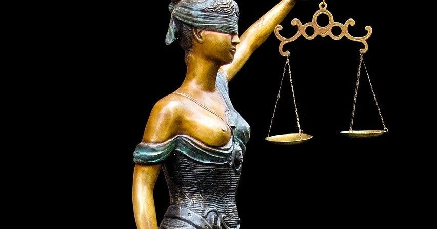

<figure>

</figure>

　高田馬場ミカドが、ボスコニアンを入れてある筐体に、押すとX68000版ボスコニアンのBGMが流れるボタンを取り付けたことが話題になっている。

[https://twitter.com/gorry5/status/1325669350880145409](https://twitter.com/gorry5/status/1325669350880145409)

　まあ、要するに商売に使っているゲーム機に、無許可で他作品のBGM流しているんじゃないかという話だ。

　この話題を目にしたとき、かつて『アカとブルー』で、あれだけ録画禁止にこだわり、SNSに上がった動画の後ろの方に写り込んだ同ゲームに対しても、法務部と相談して法的措置を取るというような発言が為されていたミカドだから、まさか無許可はないだろうと思った。

　それが、どうやら単なる無許可だったようである。

[https://twitter.com/HM\_RAIDEN/status/1325848764733562885](https://twitter.com/HM_RAIDEN/status/1325848764733562885)

　個人的にはゲーム中にBGM流すぐらい、そんなに大騒ぎするほどのことではないと思っているのだが、やはり業界大手の店がこれをやってしまうというのは、世間の人に「まずいだろう」と思わせる結果となることは容易に想像できる。

　しかも、当のミカドは、『アカとブルー』であれだけ権利を主張し、無断で使うことを厳重に監視。意図的でなくとも映像に写り込んでしまった店をSNSであげつらって叩くまでしていたのだ。そのこと自体は、商品の権利を守る当然の行いとしても、一方で自分たちは人の作品を無断で使ってもいいですよ、では筋が通らないと思われるのは当然である。

　このHEAVY METAL RAIDENというツイッターアカウントのことはよく知らないが、一連の流れを見ていると、どうやらミカドの関係者がツイートしているように見える。このアカウントの主張によると、あまりインカムがないからいいと思ったらしい。あるいは、自分の息子が作曲者を知らないから許される（？）という謎理論も展開しているようだ。

[https://twitter.com/HM\_RAIDEN/status/1325853627391508481](https://twitter.com/HM_RAIDEN/status/1325853627391508481)

　しかし、ご存知のように、すでに著作権侵害は非親告罪化されている。ゲームの権利を主張し、法務部と相談して商売する人間がこのことを知らなかったのだろうか。

[https://twitter.com/HirofumiIwasaki/status/1325722261555277824](https://twitter.com/HirofumiIwasaki/status/1325722261555277824)

　そのことに気づいたのか、件のアカウントは「客に店内放送のリモコンを渡しただけ」という言い方に変化した。ゲーム筐体にボタンが取り付けてあるらしいので、店内放送のリモコンを渡しているわけではないと思うのだが、どういう意味なのかよくわからない。謎である。

[https://twitter.com/HM\_RAIDEN/status/1325850236577746944](https://twitter.com/HM_RAIDEN/status/1325850236577746944)

　また、最後には「嫌ならやめる」「ごめんね」で済ませようということらしい。いや、客も客じゃない人も含めて、誰も嫌だと思っているわけではないのだ。ただ、ゲーセン業界を代表する店舗が、まさか無許可で曲を利用し、対価を得ているような著作権侵害をしているなんてことはないだろうという心配をしているのだ。ましてや、『アカとブルー』であれだけ権利を主張したミカドが、である。

[https://twitter.com/HM\_RAIDEN/status/1325850758244265984](https://twitter.com/HM_RAIDEN/status/1325850758244265984)

　しかもそれを「ごめんね」で済ませる。「ごめんね」！？

　これでいいのだろうか。『アカとブルー』のときにあれだけ執拗に個人ゲーセンを叩いたのに、自らは「ごめんね」で済むと考えているのだろうか。

　ちょっと信じられない感じのツイートであるが、冷静に考えると、このツイッターを誰が発信しているのかわからないし、調べる術もない。おそらく、法律を知らない人間がふざけて書いているのだろうと想像した。そうでなければ、あまりにデタラメだし、自分たちの主張を翻して権利関係をうやむやにするいい加減な発言としか言いようがない。

　もっとも、僕はSNSを通して事の次第を知っただけなので、断定的なことは言えない。上の文章も、単に自分がこのように読み取れたと言うだけの話であって、それ以上のものではない。

　しかし、世の中には、遵法精神とか規範意識というものがあり、法律を守らないことには当然世間は厳しい目を向ける。我々はどんな仕事であれ、法を遵守し、お互いに迷惑をかけないだけでなく、違法なものに接したときの世間の不快感というものにも考えを巡らせなければならない。

　何より、ミカドは『アカとブルー』のときに権利を守ることの重要さをあれだけ声高に主張したのだから、今回も「許可取ってあるに決まってるじゃねーか、アカとブルーのときに言っただろ！」とやってくれればかっこよかったのだ。それが実際は、許諾について不安視する意見が出るたびに言い逃れをして、それが世間の人々には実にみっともない姿に映ってしまったに違いない。非常に残念なことである。

　昨今のレトロゲーム人気の中、複雑な権利関係をクリアにし、苦労しながら昔の作品を掘り出している企業や人々がいて、その不撓不屈の精神には本当に頭が下がる思いだ。それだけに、レトロゲームを取り巻くファンの目はそうした権利関係に厳しいし、法的なものをクリアにした商品や環境で遊びたいと考えるのは自然な流れである。こんな世間の潮流も関係して、今回の騒ぎが起きたのかもしれない。

　僕自身は高田馬場を訪れれば、ミカドに立ち寄ることもある。その活動も応援するところではあるが、法律的な話をすればやっぱり是々非々で、きちんとしたことをしてほしいと希望している。好きなゲーセンだから、好きなメーカーだから適当なことをやってもいいという気持ちには到底なれない。おそらく、多くのゲームファンがそういう気持ちであろう。それが良識あるファンというものだ。

　決して騒ぎを起こしたいのではなく、きちんとしたものにお金を出し、清く正しく経済的発展を応援したいではないか。そういうこと。
