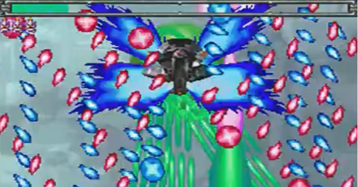

<figure>

</figure>

　Xbox Series S/Xが発売になったらしい。自分では買ってもいないし、ゲーム機が売っている店にも立ち寄っていないので、本当に発売しているのかはよく知らない。

　ところで、新Xboxの後方互換がすごいということが話題だ。Xbox Oneのゲームはもちろん、360や初代Xboxのゲームも対応次第では動いてしまうらしい。しかも、4Kにアップコンバートされて、かつ読み込みも速くなるというのだから、古くからのXboxファンとしては嬉しいことこの上ない。

　しかし、僕としては一番互換動作に対応してほしい一連のケイブシューティングがまったく動かないということに落胆している。唯一、パッケージソフトで売られていない『ぐわんげ』は動作するらしい。他はすべてダメだ。『デススマイルズ』も『デススマイルズ２』も『赤い刀』も『怒首領蜂大復活』もとにかく全部動かないらしい。

　そんなこと言って、今ケイブのシューティングゲームなんか全然遊んでないじゃないかと言われると、まったくもってその通り。すべて買い揃えたケイブシューは棚の肥やしとなり、Xbox360もほとんど起動されていない。アーケードスティックは未だに処分せず残してあるが、かつての日々のように弾幕の間をすり抜けることはもうない。

　それでも、全盛期には毎日のように弾幕シューティングをプレイし、休日には8時間～10時間ほどプレイし続けるほど情熱を傾けたシューティングゲームたちをこのまま捨て去ることはできない。平素、レトロゲームにこだわらず、新しいゲームを積極的にプレイすることをよしとしている自分であるが、数多のシューティングゲームにはどうしても特別な思いがあるのだ。

　もちろん我が家のXbox360はまだ健在だ。いつでもかつて愛した弾幕シューティングを遊ぶことができる。しかし、360もいつまでも動くわけではない。機械はいつか壊れる。どんなに代替え機を用意しても、その寿命には限界がある。そう思うと、新しく登場した後継機で、かつてのゲームがまた軽快に動作することを夢見るのはゲームファンとして当然のことなのだ。

　さあ、Xbox Series Xよ、アップデートによって弾幕シューティングブームを現代のゲームシーンに呼び戻してくれ。我々弾幕シューティングファンに愛の手を！

[https://www.youtube.com/watch?v=KbW7MR8q\_rg](https://www.youtube.com/watch?v=KbW7MR8q_rg)
