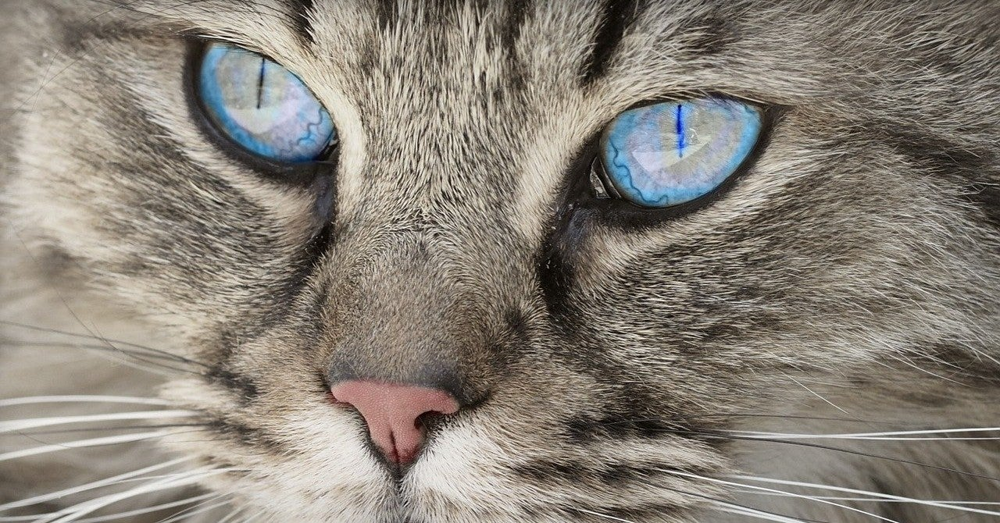
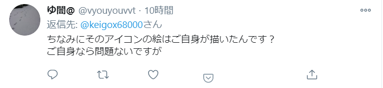
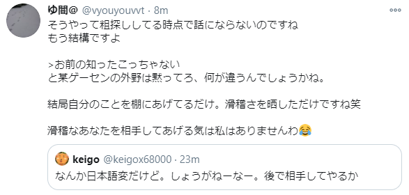

<figure>

</figure>

　先日のボスコニアンの記事が気に入らない向きがあるようで、若干ご意見を頂いている。いろいろな意見を聞けるのは楽しいので、大歓迎である。でも、もう少し理路整然と来てくれるとさらに楽しめるのでよろしく。

[https://note.com/keigox68000/n/nf989f2789404](https://note.com/keigox68000/n/nf989f2789404)

　さて今日は、僕のツイッターアイコンが自分で描いたものかというご意見（ご質問？）を頂いた。著作権のことを言うぐらいだから、自分のアイコンぐらい自分で描いているんだろうな、という論理展開と思われる。

　まあ、よくある問題をすり替えて混ぜっ返す稚拙な因縁の付け方だ。そんなところを突いても、先日のボスコニアンの件がなんら変わることはないのだが、そういうことはよくわからない人なのかもしれない。

　昔から付き合いのある人はご存知だが、僕のアイコンは妻が描いたものである。一応自分で描いていないので、件のリプライにも「はい」と返事するわけにもいかず、そもそも著作権侵害を指摘するのなら、言い出しっぺに立証責任があるのだから、それを証明してみてよと言おうかと思った。

　その途端ブロックされて、捨て台詞という典型的な展開。その後コミュニケーションを絶たれてしまって、ちょっと残念である。しかし、某ゲーセンと何が違うのか？　と言い捨てるからには、この方もミカド？　の発言に問題あると認識しているってことなのだろう。その上で他人のアイコンにケチをつけていたわけだ。結局何が言いたかったのか、その真意を知ることはできずじまいである。

　それにしても、初めて話す人にいきなり「ご自分で書いたんでしょうね」「滑稽ですね」と、あまりに失礼な言動を叩きつけて逃げるという、ちょっと良識を疑う姿は、SNS時代の悪い部分が抽出されてしまっているような事案だなと思ってしまった。

　いつも言っていることだが、反対意見をぶつけていただくのは全然構わない。むしろ、多様な意見に触れるいい機会で、こちらも勉強になるとさえ考えている。しかし、このようにSNSの機能を最大限悪利用して、しかも初対面の人に失礼なことを言っても許されると思ってしまう人間がいるのは、やっぱりネットが普及して以降の人類の課題だなと思ってしまう。

　別に、どうってことない出来事なんだけど、ネットの向こうにいる生身の人間の気持ちを蔑ろにして、自分の内にある行き場のない不満をぶつけてしまうような人がいることは、同じ人類として非常に残念である。

　とは言え、この方も心の内につらいものを抱えているのかもしれない。そういうことを慮るに、非常にやるせない気持ちになる。

　さて、ゲームしよっと。
