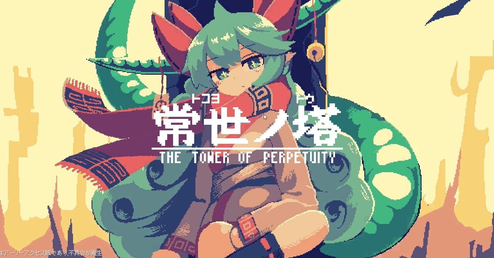

<figure>

</figure>

　『常世ノ塔』はSteamでこの11月に発売開始されたアクションゲームだ。どうやら、ゲーム自体は数年前からリリースされていたようだが、詳細はよく知らない。この度Steamでアーリーアクセスとして公開されている。

　ゲームニュースのサイトによるとローグライトという紹介がされていたため、ローグ系のゲームに目がない僕としては早速プレイしないわけにはいかなたかったというわけだ。

　ゲームはサイドビューのジャンプアクションで、4人の性能の異なるキャラクターから1人選んで、「常世ノ塔」なる24時間ごとに構造が変化する謎の塔を登り切ることが目的だ。

　ローグライトと紹介されているこのゲームであるが、プレイした感触はいわゆるローグライトとはちょっと違う。24時間で等の構造が変わるということは、丸1日は同じダンジョンを攻略することになる。難しいダンジョンのギミックに繰り返し挑戦しているうちに、どちらかと言えば、『ロックマン』のような固定されたデザインのステージを攻略しているような感覚になってくる。

　そんなわけで、思ったよりローグライトという感覚がなく、何回もプレイしてステージをクリアするゲームのようなイメージだ。

　プレイヤーはスキルと呼ばれる敵を倒せる武器を所持していて、これを駆使しながら邪魔な敵キャラを排除し、塔を登っていく。スキルは時間で回復するため、猪突猛進のゴリ押しでクリアすることは不可能だ。かと言って、ゆっくりスキルの回復を待っていると、カルマというパラメータが溜まっていき、時間切れキャラが登場してしまう。その辺りの時間管理と、敵キャラの配置を攻略していくのが肝のゲームというわけだ。

　画面は古典的なドット絵で描かれているように見えるが、明るい配色と可愛らしいキャラクターデザインで、レトロな雰囲気をもたせつつ、新しいゲームを意識させるヴィジュアルを実現している。プレイヤーに楽しい雰囲気が作ってくる作品に仕上がっているんじゃないだろうか。

　実を言えば、まだ1回も塔を登りきっていない。塔内に仕掛けられたギミックは結構難易度が高く、何回も繰り返しプレイしたのだが、志半ばであえなくゲームオーバーを繰り返すばかり。どうやらクリアにはもう少し練習が必要なようだ。

　ゲーム中のスコアは、ランキングサーバ上に保存され、プレイのたびに自分の実力をランキングとして知ることができる。これによって、世の中のプレイヤーの凄さをまざまざと見せつけられる。これが次のプレイへのモチベーションにもつながるわけだ。

　他にも、ユーザーが自分で描いたキャラクターの絵を適用できるmodもシステムとして実装しており、ネット上では自分で描いたイラストとキャラクターでゲームを楽しんでいる人もいるようだ。

　いずれにしても、まだアーリーアクセスということで、これからの展開が楽しみなゲームである。とりあえず塔をクリアするまでがんばるぞ。

[https://www.youtube.com/watch?v=39XC6WarSJs](https://www.youtube.com/watch?v=39XC6WarSJs)
