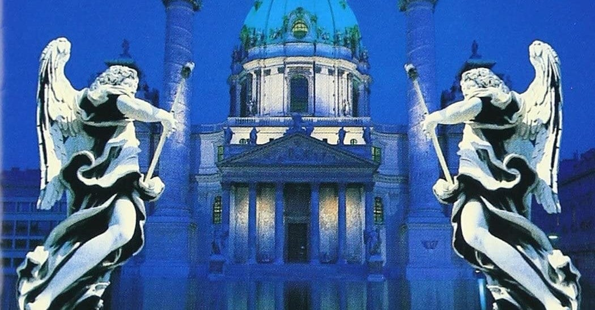

<figure>

</figure>

　"セブン・ドアーズ・ホテル"は、EUROPEの1stアルバムに収録されている曲のタイトルだ。1983年にリリースされたこのアルバムは、今でも北欧メタルの代表作と目されている作品と言ってもいいんじゃないだろうか。

　アルバムの邦題は『幻想交響詩』。正直やりすぎでありながら、これ以上ないぐらいサウンドにしっくり来る名邦題だ。ジャケットの美しさと相まって、メタルファンの記憶に忘れ得ぬ衝撃を刻み込んだ1枚である。

　今聞くとサウンドプロダクションは非常にチープ。ジョーイ・テンペストのヴォーカルも垢抜けない。ジョン・ノーラムのギタープレイはテクニカルではあるものの、やはり北欧らしいイモ臭さが鼻につく。しかし、そのすべてが当時は新鮮だったのだ。ここまで哀愁のメロディを前面に押し出し、北欧のスウェーデンという国を想起させる白夜の如きサウンドを体現したバンドはなかった。

　その中でも、このアルバムのA面3曲目に鎮座する"セブン・ドアーズ・ホテル"は、これぞ北欧メタルの決定版といえる煌めきを持っていた。アップテンポの曲調に憂いのある歌メロと何やら不思議なホテルについて歌われた、どこか幻想めいた歌詞。そのすべてが魅力的だった。この曲におけるギターソロは、決してフラッシーではないものの不思議な郷愁とむせび泣くような寂寥感に満ちていた。

[https://www.youtube.com/watch?v=CP3W3QmCQeU](https://www.youtube.com/watch?v=CP3W3QmCQeU)

　ところで、この"セブン・ドアーズ・ホテル"の歌詞には、モデルとなった映画がある。ルチオ・フルチ監督の『ビヨンド』というホラー映画だ。ルチオ・フルチは『サンゲリア』などの凄惨なスプラッターシーンを売りにしたホラー映画で有名なイタリアの映画監督であるが、この『ビヨンド』も例外なくエゲつない表現満載のホラー映画である。

　この映画の舞台となるのがその名もずばり「セブン・ドアーズ・ホテル」。過去に因縁のあるホテルには、この世に7つある地獄への門が存在し、クトゥルフ神話から引用した「エイボンの書」がその門への導き手となっている。なんと、EUROPEの"セブン・ドアーズ・ホテル"の歌詞そのままである。逆か。映画のストーリーをそのまま歌詞にしたのが"セブン・ドアーズ・ホテル"という歌だ。

　幻想的で美しい北欧メタルと思いきや、その実態はグチョグチョスプラッターのイタリアンゾンビ映画のストーリーだったというすごいオチだが、そんなことは関係なく上質のハードロックに仕上げているのがEUROPEというバンドの凄いところだったのかもしれない。

　今回の話とは全然関係ないが、この『ビヨンド』という映画のサントラは、ファビオ・フリッツィというイタリア人作曲家が手掛けていて、こちらの音楽も哀愁漂うサウンドで素晴らしい。

[https://www.youtube.com/watch?v=81Ro7vt\_U8g](https://www.youtube.com/watch?v=81Ro7vt_U8g)
