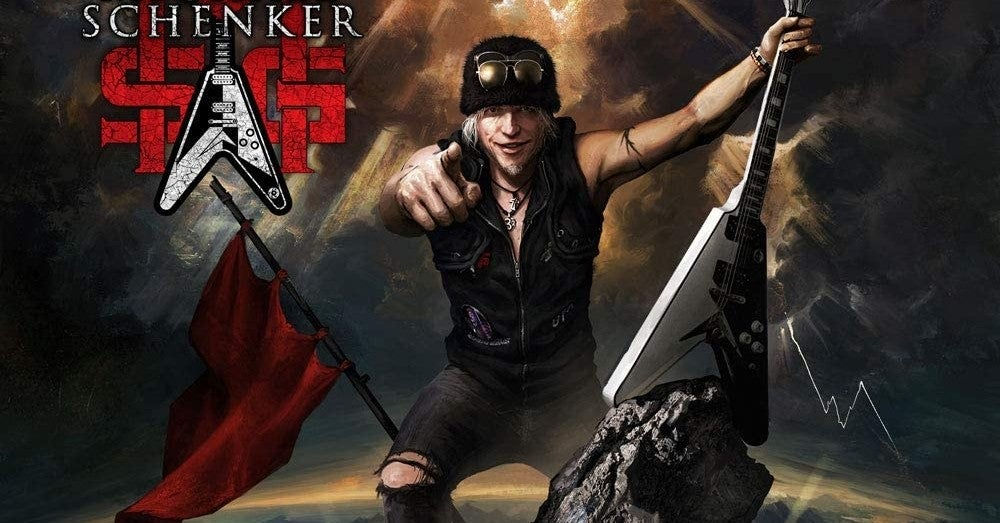

<figure>

</figure>

　そろそろ年の瀬も迫り、そろそろ今年1年聞いたアルバムを整理しようかななどと思っている。CDを買っていた時代と違い、ストリーミングで流れるように聞いている楽曲は、土しても新旧入り混じってしまい、新しいバンドとの出会いが疎かになってしまう嫌いはあるかもしれない。そういう意味でも、ときどき聞いたものを振り返る時間は大事だ。

　さて、そんな中で今年聞いた1枚にぎりぎり間に合わなくて残念なアルバムがある。マイケル・シェンカー・フェストの『Immortal』だ。今のところ、1月8日が発売予定となっている。非常に楽しみなアルバムだが、今年には間に合わなかった。

　マイケル・シェンカーが、そのキャリアにおいて交友のあったヴォーカルをゲストとして呼んでいることで話題になったマイケル・シェンカー・フェストであるが、そもそもは2011年の『テンプル・オブ・ロック』にロビン・マッコーリーがゲストヴォーカルとして参加した辺りに端を発する。その後、ライブにおいてゲイリー・バーデンやグラハム・ボネットらをゲストとして招き、それがいつの間にかマイケル・シェンカー・フェストと銘打たれて今日に至る。

　僕も実際にマイケル・シェンカー・フェストのライブを見たが、かつてのヴォーカルの面々がそろってそれぞれの曲を歌うのは同窓会的な楽しさがある。恒例の全メンバーで歌う"Doctor, Doctor"も盛り上がること間違いなしだ。2018年には、そのマイケル・シェンカー・フェストとして初めてのアルバムもリリースしている。

　で、そのマイケル・シェンカー・フェストの3枚目のアルバムとなるのが『Immortal』だ。今回のヴォーカル陣はこれまた豪華で、ロニー・ロメロ、マイケル・ヴォス、ラルフ・シーパース、ジョー・リン・ターナーまで歌ってしまう。ちなみにキーボードはデレク・シェリニアンだ。

　80年代のマイケル・シェンカーからすると、意外すぎる布陣である。しかし、そんなことを気にしないのが今のマイケル・シェンカー・フェストの強みであり、楽しいところだ。ドゥギー・ホワイトが（テンプル・オブ・ロックに）参加したときは、そういうのもありだなという感じだった。ロニー・ロメロが参加したときは、まあ流行りのヴォーカルだからそういうこともあるよね、という受け止めをした。が、しかし、今回のジョー・リン・ターナーは、そう来たか、という意外性があった。そしてラルフ・シーパースに至っては、そんなんありかー！　という驚きでしかない。そうか、マイケル・シェンカー的にこういうのもありなのか。

　そして、そのラルフ・シーパースが歌う曲"Drilled to Kill"を先行して聞くことができる。これは強力だ。あまりに強力すぎる。マイケル・シェンカー65歳。正直、もうレイドバックして気楽にやってもいい年齢である。ところが全然そんなことはないのだ。ガチガチに硬質感のある、アップテンポなハードロックナンバー。まさにラルフ・シーパースが歌うにふさわしいサウンドが飛び出てくるのだから驚きだ。もちろんファンとしては嬉しい限りである。

　多くのミュージシャンが年を取り、徐々に緩やかな音楽をプレイする中、マイケル・シェンカーに限っては逆により尖ってきているんじゃないか、更に激しくなっているんじゃないか、という気がする。ギターのプレイも乱れないし、本当にエネルギッシュな演奏を聞かせてくれる。

　マイケル・シェンカーは、僕にとって、ずっとなんとなく聞いているギタリストの一人だったのだが、2010年を過ぎた辺りから、かなりお気に入りのギタリストになってきた。今や俄然ファンである。またライブで熱い演奏が聞きたい。そう思わせてくれるギタリストだ。

[https://www.youtube.com/watch?v=bcrU9ZS6CZA](https://www.youtube.com/watch?v=bcrU9ZS6CZA)
