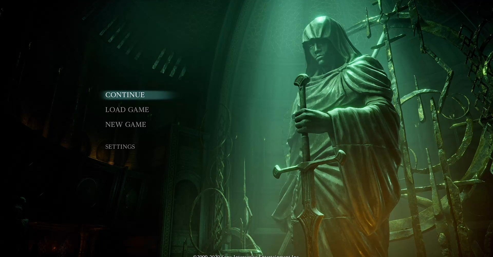

<figure>

</figure>

　『デモンズソウル』が発売されたのは2009年2月5日。ネットの噂、口コミでその評判を聞き、僕が買おうと思ったときには店頭から消えていた。過去のブログを見てみると、10日ほどしてからようやく手に入ったようだ。

[http://keigox68000.hatenablog.com/entry/20090215/p1](http://keigox68000.hatenablog.com/entry/20090215/p1)

　PS3で発売されたゲームのため、グラフィックは十分に美しかったが、それ以上にダークファンタジーな世界観が気に入った。剣と魔法をテーマにしたゲームは星の数ほどあれど、これほどヴィジュアルからストーリーに至るまで徹頭徹尾重苦しく、閉塞感のあるファンタジー世界を描いたゲームは少ないのかもしれない。

　そして、その閉塞感に輪をかけるように、ゲームの難易度が高かった。『デモンズソウル』は、（主に）右手に持った武器と左手に持った盾で数々の敵を退ける単純なアクションゲームながら、攻撃と防御のタイミングがシビアに設定されている。特に盾で敵の攻撃を受け流す「パリィ」はその最たるもので、うまく決まればプレイヤーは圧倒的優位に立てるし、失敗すると手痛いダメージを受けることになる。

　こうしたシビアなアクションを要求されるゲームであるから、無策で敵の真っ只中に飛び込めば、プレイヤーはあっという間に袋叩きにあい、簡単に死んでしまう。普通のゲームでは雑魚と呼ばれるような敵であっても、その数や配置を常に気にして、それなりの戦略を練っていかなければ、ゲームのスタート地点から前へ進むことすら難しい。

　絶望的な閉塞感に高難易度のアクション。普通に考えると、とっつきにくい初心者お断りのゲームにしか思えない。しかしこれが受けた。前評判も高かったが、それ以上に発売後の人気が爆発したようだ。とても万人受けするようなゲーム内容ではないが、全世界で累計出荷数100万本とも150万本とも言われている。この「全世界で」というところがポイントで、世の中の人々に、まだまだこういう本格派ゲームが受け入れられるということの証明になった。

　『デモンズソウル』は死にゲーとも呼ばれ、とにかくよく死ぬ。初めて行った場所では、敵がどこに潜んでいるかわからず、必ず死ぬ。敵の配置を把握しても、アクションの操作が思うように決まらず死ぬ。プレイヤーが死ぬための要素がこれでもかというぐらい用意されている。死ぬためにゲームをやっていると言っても過言でないぐらい死ぬのだ。

　ゲーム中では、敵を倒すとソウルという魂のかたまりのようなものが入手できる。このゲームの世界において、ソウルはレベルアップにもアイテムの売買にも必要な通貨のような存在であるが、死ぬとせっかく稼いだソウルを落としてしまう。しかし死んで蘇った後、死んだ場所までたどり着けば、その場に落ちているソウルを回収することができる。ただし、これは1回だけのチャンスだ。落としたソウルを回収する前に死ねば、その前に落としたソウルは永遠に失われる。そんなシビアなシステムのゲームだ。

　さらに『デモンズソウル』は、ネットワークに対応したゲームでもある。オンラインでプレイしている人のゲームに参加し、ともにゲームを攻略したり、逆に敵対して相手のプレイヤーを死に追いやることもできる。高難易度の『デモンズソウル』において、協力プレイはなにものにも代えがたいありがたいシステムだ。自分の力だけで攻略できないエリアも、協力者がいればなんとかなることも多い。しかし、敵対する相手はプレイヤーにとって非常にありがたくない存在だ。ゲームを遊んでいると、メッセージとともに突然やってきて、プレイヤーに戦いを挑んでくる。負ければもちろんすべてのソウルを失う。非常に緊張感のあるシステムだ。

　ゲームの世界観は暗い。アクションは高難易度。オンラインでプレイヤーを妨害する侵入者が存在する。『デモンズソウル』は実に敷居の高さが三拍子揃ったゲームなのである。

　それでも人々はこのゲームに熱狂した。崩壊に向かおうとしてるボーレタリアは果たしてどうなるのか。自らも不死の仲間入りしてしまったプレイヤーの運命はどうなるのか。何より、目の前に立ちふさがる強大なデーモンを倒すためにはどうすればいいのか。そのすべてがプレイヤーのモチベーションを揺り動かし、死んでも死んでも繰り返し再チャレンジしてしまう。そんな魅力を生み出していた。それが『デモンズソウル』だった。

　その『デモンズソウル』がPS5で蘇る。その世界が再び体験できるのはすごく楽しみだ。PS3版は、今プレイすると少し動きがもっさりしている。その辺りも次世代機（PS3から数えれば次々世代機だ）では解消されるだろう。純粋にアクションが楽しめるのは、ゲーマーとしては何より嬉しいことだ。覚悟を決めてこの高難易度アクションに挑むことにしよう。

[https://www.youtube.com/watch?v=9nFIBrWo-G4](https://www.youtube.com/watch?v=9nFIBrWo-G4)
