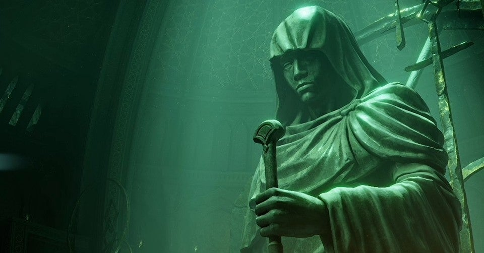

<figure>

</figure>

　PS5を手に入れてから、ほとんどを『デモンズソウル』で遊んでいる。その合間に『デッドバイデイライト』もプレイしているのだが、それについてはまた書こう。

　PS5版『デモンズソウル』は、かつてPS3向けに発売された『デモンズソウル』のほぼ忠実な移植だ。忠実な移植だが、結構変わっているところも多い。

　購入前に漏れ聞こえてきたのは、登場人物が微妙に変化しているということだ。登場人物自体はPS3版『デモンズソウル』から変わっていないのだが、その人物が、黒人になったり、東洋人になったり、明らかに見た目が変化している。これは、ポリティカル・コレクトネスの観点から、多様な人種を取り入れたためだという話が聞こえてきたが、真相は定かではない。でも多分そうなのだろう。

　そういうものに敏感に反応し、拒否反応を示すユーザーもいるようだが、僕は特段気にならない。ゲーム性になんら変わりなく、『デモンズソウル』の本質に影響しないからだ。とは言え、ゲームのアピアランスというのは大切だ。思い入れのある人物が突然違う姿になってしまったことでショックを受ける気持ちはわからなくもない。

　一方でゲームの方は、60fps化されたことと、グラフィックの描画がより精細になったことで、より細かい部分まで見え、なおかつ軽快な操作感が実現している。ゲームプレイそのものを楽しむには、この辺りが大事で、そういう意味では期待以上の生まれ変わりができたんじゃないだろうか。PS3版では若干のもたつき、重さを感じたキャラクターの動きも、良好なアクションで遊びやすい。

　しかしながら、ゲームそのもののギミックはまったく変化なく、ボスまでの道程は相変わらず茨の道で、ショートカットや親切なセーブポイント（？）の類いはPS3版から変わらず存在しない。昨今、リメイクゲームでは親切な要素が追加されがちなところだが、そこを敢えて原作通りのスパルタンな仕様で再現したことには好感が持てる。もちろん、プレイする側も『デモンズソウル』以降のフロムソフトウェア作品で鍛えられているから、『デモンズソウル』ぐらいの難易度ではもはや驚かない。久しぶりにプレイする『デモンズソウル』は勝手知ったる自分の庭のごとし。昔に比べて遥かに軽い足取りで攻略できそうだ。

　そして、今回のPS5版で何よりも恩恵を受けているのが、内蔵SSDによる読み込みの速さだ。プレイヤーの拠点となる神殿から、各マップへの移動にはどうしても読み込み時間がつきまとうわけだが、それがわずか数秒で目的地に到着する。これは実に快適だ。死んでしまったときも、再びゲームを始めるためには30秒ほどの読み込みがあったのが、こちらも数秒で復活することができる。いくらでも死んでやり直せるってことだ。

　そんな感じで、様々な意見がある中、個人的には大満足のPS5版『デモンズソウル』であった。しかし、一点だけ大きな不満がある。それは、PS5のユーザー自体が少ないせいか、オンラインでの協力／敵対プレイがほとんどマッチングしない。あるいはすごく時間がかかる。『デモンズソウル』は、ソウル傾向というパラメーターがオンラインプレイに関わっているので、マッチングしないとどうにもならない要素が出てきてしまう。また、強力なボスが現れた場合など、助けを呼ぶことができないと、単純に攻略が行き詰まってしまう。この辺りをなんとかしてほしいところだ。

　とは言え、これはPS5の普及台数（かつ『デモンズソウル』のプレイ人数）如何に関わってくるので、今すぐどうにもならない。早くユーザーが増えることを祈るのみだ。さて、まだしばらくは『デモンズソウル』の日々が続きそうである。

[https://www.youtube.com/watch?v=67XtFiO0zkE](https://www.youtube.com/watch?v=67XtFiO0zkE)
