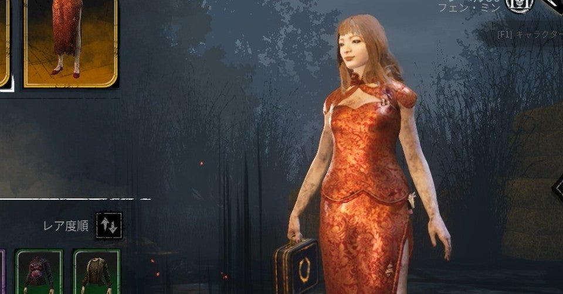
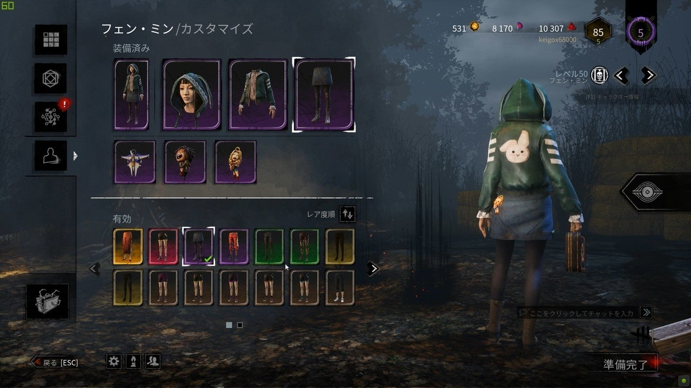

<figure>

</figure>

　最近のゲームは、ゲーム内で服装を変えることができるものが多い。いや、最近でなくともFPSなどでは結構前から見た目だけを変更する設定があった。

　僕は、あまりゲーム内でのキャラクターの見た目には頓着しない方だった。見た目がどうであれ、ゲームのプレイ内容が大事だと思っていたからだ。

　しかし、『デッドバイデイライト』をプレイするようになってから、キャラクターの見た目、スキンを変えてみるのも楽しいと思うようになってきた。

　いつも使っている『デッドバイデイライト』のキャラクター、フェン・ミン。デフォルトの服装はプロゲーマーチームのユニフォームという設定だ。

　輝くライトブルーのラインをあしらったシャツとショートパンツ。背中にはレーザーベアというクマの絵が描いてある、クールながらかわいらしいデザインだ。

　しかし、ゲームプレイ中はときどきパーカー姿のスキンを使用してみたりする。こちらは、背中にデカデカとウサギが貼り付いた、ちょっと笑えるデザインになっている。フードにウサ耳がついているのもご愛嬌だ。

　そしてこの季節ならではのアウトフィット。クリスマスシーズンならではのダサいセーターもある。前面にレベルアップの文字とコントローラーの絵柄。そりゃないでしょ、と言いたくなる服装だ。

　以前、旧正月イベントでは、真っ赤なチャイナドレスも配布された。

　背中が大きく開いた大胆なデザインで、どうもフェン・ミンは背中で語るタイプ（？）なのかもしれない。

　とまあ、こんな感じで、以前はゲーム内キャラクターの服装など全然木にしていなかったのだが、こと『デッドバイデイライト』に関しては楽しい服装にしてみるのもアリだなと感じている。

　しかし、困ったことに楽しい服装はどれも目立つ。おかしな格好をしているキャラクターは、真っ先にキラーの標的になることが多い。実際ゲームの画面的にも、目立つキャラクターは追いかけやすいので、すぐにターゲットにされるのだ。つまり、楽しい服装をしたければ、腕を上げてキラーとチェイスせよ、ということだ。そんなところにも『デッドバイデイライト』というゲームのやりがいを感じている。

　まあ、とりあえず運営はバグを直してくれ。

[https://www.youtube.com/watch?v=E0XNnBQMJcI](https://www.youtube.com/watch?v=E0XNnBQMJcI)
