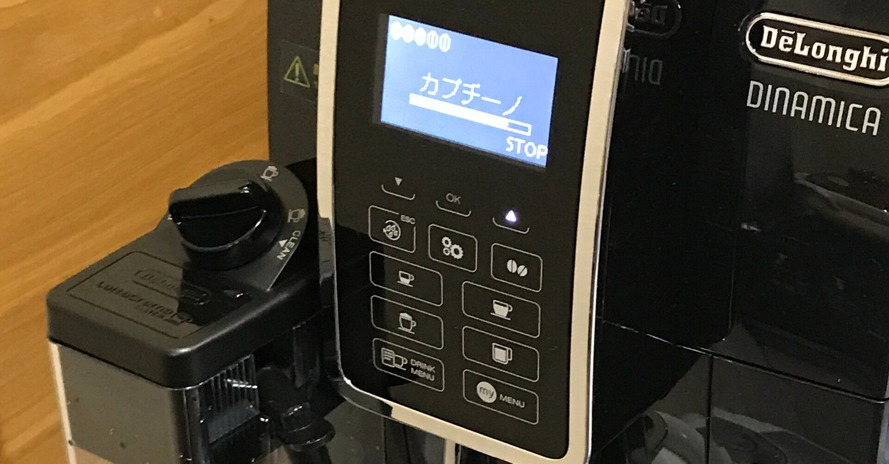

<figure>

</figure>

　エスプレッソとかカプチーノを、おうちで手軽に楽しみたいと思い始めて早10年。いろいろやってみたけど、めんどくさいと続かないということで、全自動のコーヒーマシンを導入してみた。

　買った機種はデロンギのディナミカという機種。日本では最近発売されたばかりの機種で、ミルクの泡立てが自動でできるお高いモデルだ。悩んだ挙げ句に、エイヤッとばかりに買ってしまった。

　以前は、同じデロンギのエスプレッソマシンを使っていたのだが、専用のコーヒーポッド（挽いた豆がパックに入っているやつ）を使うところが好きではなくて、そのうちやめてしまった。あれって割高な上にラインナップが貧弱なのだ。もちろんエスプレッソマシンは自分で挽いた豆も使えるのだが、タンパーというハンマーの先が取れたような道具でコーヒーの粉を固めたりしなければならず、やっぱりめんどくさいのだ。

　で、今回買ったのはそういうのを全部機械がやってくれるコーヒーマシン。一般的なドリップコーヒーとは抽出方法が違うので、厳密にはエスプレッソしか淹れられない機械だが、そこは多機能で普通のドリップコーヒー風の淹れ方もできるスグレモノだ。

　果たしてお値段に見合った味が得られるのか微妙なところだが、まあたまにはこういう贅沢もいいだろう。これでクォリティオブライフが向上するのならば安いものだ。本当に安いのか？　もしかしてうちにある家電製品で一番値段高いんじゃないか。

　そんなことを思いながら、とりあえずエスプレッソ抽出してみたり、カプチーノを作ってみたりしたが、予想以上に美味しかった。後悔するようなマシンじゃなくてよかった。あと、デロンギは初期不良の話も聞いたりするけど、そんなこともなくて一安心だ。ちなみに、実家にある同じデロンギのコーヒーマシンは初期不良にあたってた。

　そんなわけで、珍しく思い切った買い物をしたわけだが、しばらくはコーヒー生活が楽しくて仕方ないような気がしている。うん、せっかくの高い買い物。思いっきり楽しむことにしよう。豆はいつも焙煎度合いを指定できる店で買っているので、今後はより豆の違いを楽しんでみよう。
