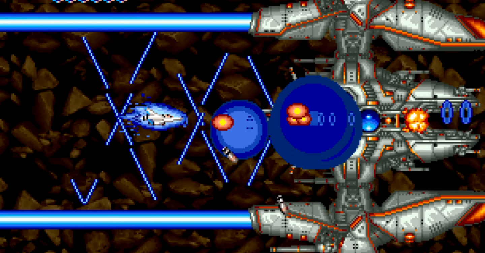

<figure>

</figure>

　さて、『グラディウスIII』だ。アーケードアーカイブスの企画が始まった頃、まさか『グラディウスIII』がラインナップされるとは思っていなかった。考えてみると、これでアーケードアーカイブスには『グラディウス』『グラディウスII』『グラディウスIII』と３作揃い踏みというわけだ。再現性云々を言っている人もいたけど、まあ無粋ってもんでしょ。

　それはともかく、『グラディウスIII』というシューティングゲームにはあまりよろしくない部分もあることは以前noteにも書いた。

[https://note.com/keigox68000/n/n392e957f65f1](https://note.com/keigox68000/n/n392e957f65f1)

　それでも、こうやって過去の話題作が何らかの形で移植されることはいちゲームファンとして嬉しく思うし、大歓迎だ。もちろん早速買った。あの当時ゲーセンで十分に攻略できなかった恨みをここで晴らそうという気にもなる。

　もちろん、期待の大きい作品だけに、今回はただのベタ移植ではない。フル装備や当たり判定表示など便利機能を備えた、ちょっと気の利いた移植になっている。こういうのって、古いゲーマーとしてはすごく嬉しいことだ。

　同じアーケードアーカイブスの『トライゴン』も、当たり判定を小さくするオプションが実装されていたが、こういうちょっとしたアレンジを入れ込んでくる辺り、本当にプレイヤーのことを考えてくれていると思う。あるいは、そのゲームのことがわかっている人が関わっているということがうかがえる。すごくありがたいことだ。

　奇しくも、先日発売になったばかりの『アストロシティミニ』に収録されたゲームで、エミュレータ上でクリアできないバグがそのまま再現されてしまったことが騒ぎになっている。それに比べると実に対象的な話ではないか。

　ちなみに、アーケードゲームではないが、過去の名作の移植ということで話題になった『真・女神転生III HD REMASTER』も、いざ発売されたら動作速度に問題があったなどという事件も記憶に新しい。こちらは、メーカーが問題を真摯に受け止め、昨日修正アップデートが配信された。

　いずれにしても、過去のゲームを現代に蘇らせるのは簡単ではないということだ。20年前、30年前から比較して、現在のテクノロジー、コンピュータの進歩は眼を見張るばかりである。それでも、過去のゲームを、昔のとおりに再現することは難しい。処理速度やスペック的に当時のハードを凌駕している現在のゲーム機と言えども、その細かな部分を再現するということになると、必ず人間の目や耳、感覚が必要になる。そういうことのようだ。

　そういう意味で、今回のアーケードアーカイブス『グラディウスIII』はよかった。かつてのゲーマーにとって無二のクリスマスプレゼントになることだろう。
