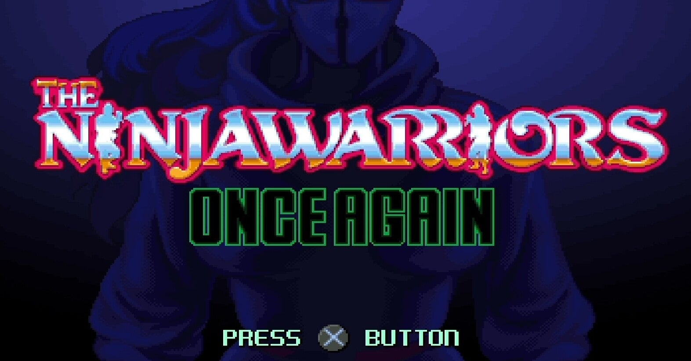
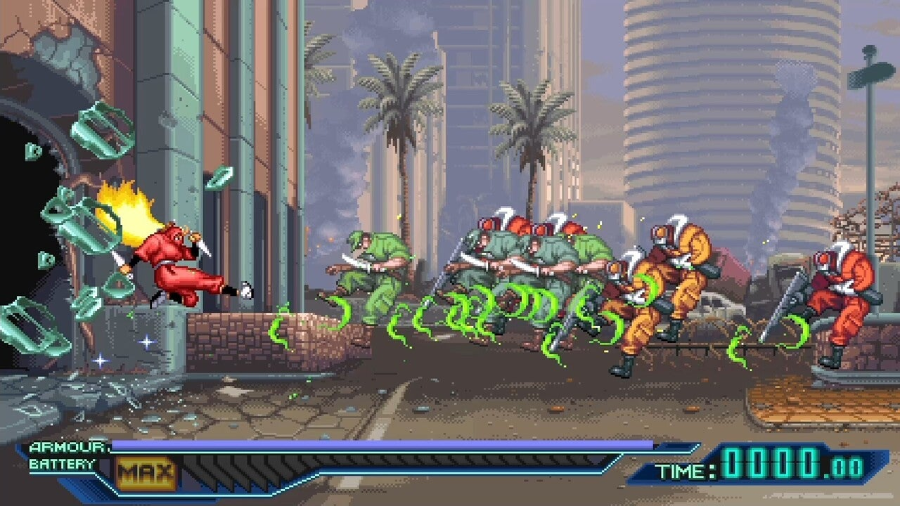
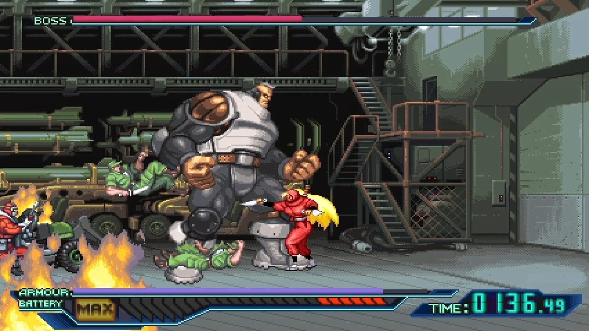

<figure>

</figure>

　『ニンジャウォーリアーズワンスアゲイン』というゲームがセールで半額になっていたので買ってみた。

　かつてタイトーが『ニンジャウォーリアーズ』というアーケードゲームをリリースしていたが、その続編的なアクションゲームでスーパーファミコン用の『ニンジャウォーリアーズアゲイン』というのがあって、それを踏まえて2019年にリリースされた新作が『ニンジャウォーリアーズワンスアゲイン』だ。

　早速プレイしてみた。古き良きドット絵の雰囲気はそのままに、ゲームをクリアすることで使用できるキャラクター（忍者型アンドロイド）が増えるなど、ファンには嬉しいアレンジがなされている。

　簡単な操作で多彩なアクションができるのも楽しく、難易度は作業にならない程度に難しく、かと言ってクリアできなくて投げ出さない程度には易しい。よくできたアクションゲームだ。

　しかし、よくできている分、ちょっとした粗が目につく。おおむね楽しく遊べる調整がされたゲームながら、少しだけストレスが溜まるのだ。どうもゲーマーは面倒でいけない。

　例えば、画面の左右から次々に襲ってくる敵だが、当然プレイヤーの攻撃に合わせて身を引いたり、避けたり、そういう行動をする。それはいいのだが、このゲームは画面外に少しバッファがあり、敵キャラが頻繁に画面外へ逃げ出してしまうのだ。もちろん他のゲームにも同じようなことはあるのだが、本作ではとにかくほとんどの敵が画面外へ出ていってしまうので、敵キャラの処理に時間がかかる。そうさせないのもテクニックの内とは言え、非常にストレスがたまる。

　また、プレイヤーにはバッテリーゲージがあり、これが満タンになると特別な攻撃が行える。場合によっては、強力なボス敵を攻撃したり、ピンチの状況を打開するための重要な攻撃方法となる。しかしこのゲージが、敵の攻撃を受けると一気にリセットされてしまうのだ。敵に殴られ、ピンチに陥ったときこそ、むしろ強力な攻撃で切り抜けたいのに、それを許さぬ過酷なゲームシステムなのである。ゲージを満タンにして、一気に逆転しようとしたところを、敵のチョップで潰されて、ゲージもろとも攻撃の機会を失うと、なんともイライラしてしまう。このシステム考えた人は、本当にこれで面白いと思ったのだろうか。疑問だ。

　さらに、いくつかのステージでは、画面外からミサイルのようなもので遠距離からの攻撃を受ける。プレイヤーキャラの歩いている路面に影が落ちたら要注意。その場所にミサイルが降り注ぎ、爆風で敵味方関係なくふっ飛ばされる。もちろん、こういう緊張感ある演出があってもよいだろう。プレイヤーは多彩なアクションでそれを避け、あるいは上手に敵を巻き込んで戦いを有利に展開させるのもゲームの楽しみかもしれない。しかし、このゲームでは、この画面外ミサイル攻撃が数カ所にわたって存在する。ちょっと多い。特に、ジャンプ後に自由に動けないこのゲームでは、着地地点にミサイルがタイミングよく落下してくると、非常に残念な気持ちになってしまう。ボス前で体力を温存したいときなどなおさらだ。もう少し限られたシーンでの演出にとどめてほしかった。

　とは言え、最初に書いた通り、全体的によくできたアクションゲームで楽しく遊べる。1回クリアすると初代『ニンジャウォーリアーズ』のBGMをゲーム中に流せるのも楽しい。ZUNTATA初期のチープなELOみたいなノリの楽曲は嫌いじゃない。しかし、よくできているだけに気になるところが目立つのも事実で、つい文章にしてしまった。

　しかし、何より改善してほしいのは、ゲームオーバーからコンティニューでゲームが始まるまでの時間が、本当に微妙な感じで長いところである。何気にこういうのがストレス。わがままだな、ゲーマー。
