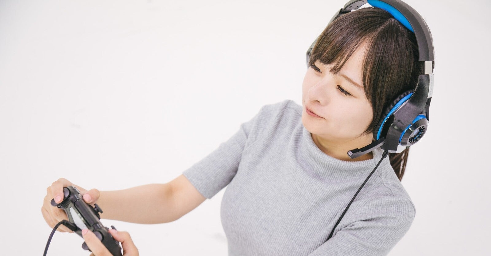

<figure>

</figure>

　棚にゲームソフトのパッケージが並んでいる。もう何年もプレイしていないXbox360のソフトが多いか。その他のゲーム機のものも並んでいる。最近は、もしかしたらもう一生遊ばないゲームもあるだろうということを考え始めている。

　いわゆる積みゲーではないのだが、かつて散々プレイしながら、時代の移り変わりとともに徐々に遊ばなくなったゲームが未だに棚に鎮座している。僕はどちらかと言えば、遊び終わったゲームは処分してしまう方だが、それでも手放すのがためらわれて、ひたすら棚に並べているだけのゲームがたまってきた。

　ただ置いておくだけほど無駄なこともないと思い、何度かまとめて売却することも考えた。実際に何本かは売ってしまったものもある。しかし、その結果いまだに残っているゲームは、売ってしまったゲームたちより、さらに思い入れが強いだけあって、余計に売ることが難しくなっている。

　それらのゲームを、もう何年も遊んでいないことを考えると、この先もほとんどプレイすることはないであろうことが予想される。それで、もう一生遊ばないゲームもあるだろうという結論に達するわけだ。

　もし、今手元にあるゲームソフトを売ったら、おそらく二度と手に入らないものも多いだろう。昨今のレトロゲーム事情を考えると、それは確実である。そういう思いもあって、さらに手放すことができないのだ。

　もちろん、ゲームソフトをずらりと棚に並べて、そこに存在するだけの状態を楽しむという趣味もあるだろう。しかし、僕はあくまでゲームは自分でプレイして攻略するものだという意識で遊んできた。買って満足するとか、集めて一人ほくそ笑むという楽しみ方はつゆほども考えたことがなかった。それで、遊んでないゲームの存在意義が気になってしまうのだろう。

　いやしかし、世の中を見てみれば、ゲームソフトそのものが貴重な存在となり、古いゲームはそこに置いてあるだけで存在感を醸し出すものになりつつあるのかもしれない。

　かつて、『あそぶ！ゲーム展』というゲームの歴史を追いかけた展示が話題になった。標題にわざわざ「あそぶ！」と入っているのだから、逆説的に遊ばないゲームの展示もあり得るということなのだろう。

　そう考えると、僕自身も少し意識を変えて、古いゲームを棚に置いておくだけで満足感を得るような、そういう考え方に気持ちを持っていく時期なのかもしれない。

　なんとなく、ゲームをプレイして攻略しなければならないという強迫観念があって、それが「置きゲー」という楽しみ方を阻害しているのかもしれない。このテーマには死ぬまで向き合っていかねばならないのかも。
