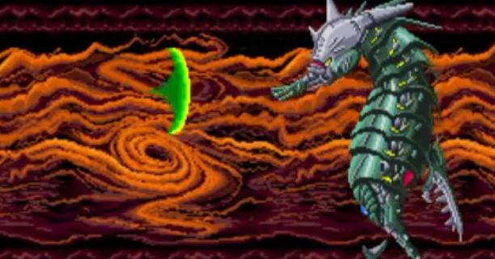

<figure>

</figure>

　ときどき話していた話題だが、どこかに書いておこうと思って書く。『ダライアス』の話だ。

　ご存知『ダライアス』。3画面筐体のすごいやつがゲーセンに登場したと話題になり、当時早速友人とゲーセン詣をしたものだ。とにかく筐体がでかい。それだけで迫力がある。しかも、振動するボディソニック、響く重低音で迫りくる巨大戦艦の数々は、当時のシューティングゲームとしては圧巻の一言。他に比べるもののない超弩級ゲームだった。

　この『ダライアス』は、ステージクリア時にコース選択があり、バリエーション豊かな展開が楽しめるゲームだった。毎日のようにゲーセンに通い、どのコースを選択するのがクリアへの近道かを探った。『ダライアス』はレベルデザインに荒っぽいところがあり、選択するステージによってまったく難易度が異なっていた。

　ある日僕は、強敵であるステージ4のピラニアボスこと、ファッティ・グラトンを念願かなって撃破するに至る。コース選択が幸いしたのか、そのままステージ5のボス、キーン・ベイオネットにも遭遇。そのまま所見で撃破してしまった。若いときはゲームの才能にもほとばしるエナジーがあるもので、調子に乗った僕は、そのままステージ6のボス、アイアン・ハンマーにも到達。これもそのまま初見撃破してしまう。

　『ダライアス』をクリアしたことがある人ならば知っているかもしれないが、最終ステージにZゾーンを選択した場合、装備さえ整っていれば、道中は比較的簡単である。そう、そのままステージ7のボス、グレート・シングにまで到達してしまったのだ。あの頃は本当にゲームが上手かったと思う。

　一気に最終ステージまで到達した緊張感と、（当時としては）あまりに巨大なグレート・シングの姿に、足に震えが来てしまったのを覚えている。人間、極限状態に達すると本当にガクガクするものだ。

　残念ながら、そのときはグレート・シングに破れたが、それからは各ボスのコツもつかみ、安定してクリアできるようになっていく。やがて、他のコースも試し、全ボスを制覇しようと目論見る僕であった。

　しかし、何回プレイしても、Wゾーンのタツノオトシゴボスことグリーン・コロナタスだけは倒せない。画面のどこにいても、放射状に連続発射される弾を避けるのが厳しくなり、特にボスに接近されると一気にバリア（アーム）が剥がされ、あっという間にやられてしまうのである。

　この頃になると、各ステージの攻略はすっかり安定期に入り、確実にラスボスへたどり着けるようになっていた。しかし、相変わらずグリーン・コロナタスだけは倒せない。虚を突いて弱点の頭部に張り付いても、ボスの後ろ側に回り込んでも、まったくスキがないのだ。

　さらに、グリーン・コロナタスの頭部は硬そうなヘルメット（？）に覆われていて、これを破壊しなければ、本当の弱点に攻撃することはかなわない。しかしあろうことか、一度ミスをすると、たとえ頭部のヘルメットが破壊されていても、これが元に戻ってしまうのだ。（実際は、少しダメージが残っているが、見た目にはわからないので、当時は愕然とした）

　あまりに繰り返しプレイしすぎて、夢にまで『ダライアス』が登場する始末。まったくあきれたゲーム生活である。（今もそんなに変わらないけど）

　ところがである、ある日夢の中でグリーン・コロナタスに対峙した僕は、なぜかボスの吐き出す弾を上へ、下へと交互に動き、誘導しつつその弾道を避けていたのだ。

「これだ……！」

　目を覚ました僕は、早速ゲーセンへ行って試してみる。もう何回も通ったコースを選択してグリーン・コロナタスの前に再び立っていた。夢で見たのと同じように、上下に自機を動かし、拡散弾を誘導しながら、さらにその移動範囲の上下端では、自機を前に進ませることによって確実に弾を避けることができる。これならまったく被弾せずに弱点を攻撃できるぞ。

　かくして、あれだけ苦労したグリーン・コロナタスをあっけなく撃破してしまった。今まで見たことがない真っ赤な夕日のエンディングが眩しかった。人間、極限状態に達すると、本当に天啓が降りてくるのかもしれない。

　その後、友人たちとこの攻略法をシェアする中で、その独特な拡散弾誘導の動きは「三日月」と名付けられる。その後ゲーム雑誌などで同様の攻略法が紹介されるが、奇しくもそこには「三日月」と書かれていた。もしかしたら、全世界の悩めるゲームキッズの上には、同じ啓示が降りてきていたのかもしれない。
