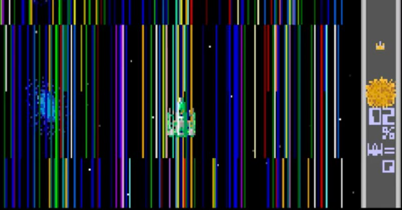

<figure>

</figure>

　アーケードアーカイブスで『ハレーズコメット』がリリースされた。これは、タイトーが1986年、つまり前回のハレー彗星が地球に再接近したのに合わせてリリースされた宇宙的タイアップシューティングゲームなのだ。

　『ハレーズコメット』は、太陽系に迫りくる彗星と、それに便乗して侵略してくる宇宙船をとにかく撃破する縦スクロールシューティングだ。ゲームシステム的には実に単純で、特筆すべき点はないのかもしれない。

　しかし、ド派手なパワーアップと透明感あふれるBGM、緑を基調とした独特のグラフィックで印象に残っているゲームキッズも多かったのではないだろうか。何より話題のハレー彗星を題材に、侵略者と戦うゲームに仕立て上げた大胆さが、さすが何でもありのタイトーである。

　『ハレーズコメット』は、パワーアップしたときの気持ちよさと、遊びやすい難易度で、僕もよく遊んだ。50円で長時間プレイできるので、貧乏学生には歓迎された。仲間内でも人気があったゲームだったように記憶している。

　しかし、豊富なパワーアップアイテムと、最強状態のド派手さの裏返しとして、1回でもミスすると、自機が一気に初期状態に戻り、敵の激しい攻撃に対応できなくなるゲームでもあった。根気よく復活することも可能だが、いずれにしてもやられた瞬間にプレイヤーのやる気は半減。遊びやすさが考えられているようで、全然考えられていないゲームでもあった。

　『ハレーズコメット』は、すごく人気のある有名タイトルではなかったかもしれないが、その癖の強さで印象に残っているゲームだ。それがこうして移植されるだけでもすごく嬉しい。次のハレー彗星最接近まで、遊び続けることにしよう。

　しかし、35年ぶりにプレイしてみると意外に難しかったり……

[https://www.youtube.com/watch?v=Pkihrc4lqYE](https://www.youtube.com/watch?v=Pkihrc4lqYE)
