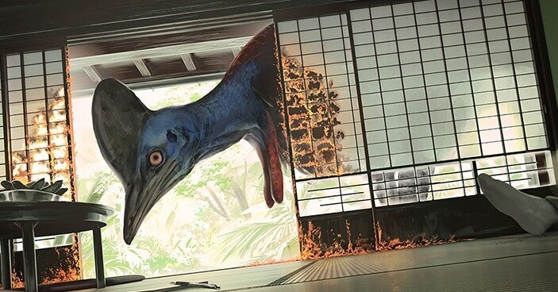

<figure>

</figure>

　久々にホラーを読んだ。物語の舞台が信州ということで、つい手にとって見たのだ。

　自分で住んでいて言うのも何だが、日本の地方。それも、間近に山や森があり、都市部でも車で2,30分も走れば巨大な闇があるという地域は、もうそれだけでホラー然としている。

　本作は、それに加えて、戦時のパプアニューギニアで物資も兵器も限られながら行軍する日本兵の姿が描かれる。信州の土着的な闇と、戦地の悲惨な情景が合わさり、陰惨な物語のシルエットが浮かび上がる。そこがこの小説の魅力だ。

　ヒクイドリは実際に存在する鳥だ。パプアニューギニアに生息していて、体が非常に大きく、その頭部は青や赤といった極彩色で彩られている。動物園などで見れば愛嬌のある南国の鳥というイメージであるが、この本の表紙に描かれた火喰い鳥は、不気味な化け物そのものである。

　火喰い鳥のエピソードを混じえつつ、現実とも夢ともつかない場面が次々と現れ、やがて物語は思いも寄らない結末へと向かっていく。

　個人的には、物語中に登場する様々な要素が、もっと整合性を持って結末へ繋がると、読む者を圧倒できるのではないかという感想を持たないでもないが、しかし、不穏な予感をもたせつつ進行するストーリーは、ホラーらしい陰鬱とした雰囲気が存分に発揮されていてよかった。

[https://www.amazon.co.jp/dp/4041108543](https://www.amazon.co.jp/dp/4041108543)
