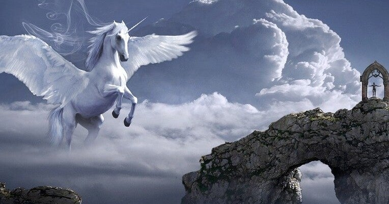

<figure>

</figure>

　少年の頃、ゲーム好きが高じてファンタジー小説をよく読んだ。それこそ『ウィザードリィ』や『ウルティマ』が出てきた時代で、当然のように『指輪物語』とか『ホビットの冒険』に始まり、『ドラゴンランス戦記』などゲーム由来のファンタジー小説も読んだ。

　しかし、いつの間にかファンタジー小説って読まなくなってしまうものだ。大人になるとファンタジーは卒業してしまうという話は本当だった。

　もちろん、別にファンタジー小説を子供だましだと思っているわけではない。『指輪物語』の壮大な世界観などは、今読み返してみても本当にファンタジーの世界をそこに存在させるぐらいの説得力はあったし、緻密な設定に裏付けられたファンタジーの重厚さは今でも好きだ。

　しかし、読まなくなってしまうのだ。ここ数年の読書履歴を振り返ってみても、新作ファンタジー小説で読んだのは『火狩りの王』と『ウィッチャー』ぐらいだ。しかも、どちらも最初の1,2冊で途絶えている。

　これはファンタジー小説がつまらなくなったというわけではない。そうではないのだが、大人になっていろいろな社会の軋轢に削られて消耗すると、どうも夢物語のお話しでは刺激が無くなってしまうような気がする。

　それよりも、現実にありそうな陰惨な事件や、ドラゴンや幽鬼のように主人公の命は脅かさないけれども、もっと身近に我々の生活に密着した、経済的、社会的な脅威の方に、自分自身の世界のテーマが置き換わっているのだと思う。

　現実的な脅威に目を向け、社会の問題に思いを致すことは、いかにも大人らしくて、人間として成長した考え方かもしれない。しかしその一方で、自分の世界はなんと狭くなってしまったのか。少年の頃は、もっと奇想天外な冒険に心躍っていたのに。そう思ってしまうこともある。

　社会の悪や、組織の圧力と戦う主人公もいいが、たまにはドラゴンと戦っていた時代に戻ってみるのもいいのかもしれない。閉塞感に打ちひしがれる現代社会から逃れるヒントが、そこで見つけられるかも。
