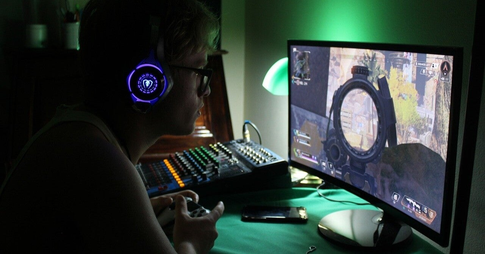

<figure>

</figure>

　相変わらずレトロゲームの新作（！？）リリースが好調である。生まれたときは手に精密レバーを握っていて、立ち上がると同時にインサートコインしていた生粋のゲーマーとしては嬉しい限りだ。

　しかし、同時に30年前、40年前のゲームに興じていればそれで幸せなのかという疑問も持ち続けている。最新のテクノロジー、まったくの新発想による新しいゲームをプレイし続けたい気持ちもずっと心のなかにある。しかるに、昔時間を忘れて遊んだゲームがあれば、もうそれで幸せというのは、完成の墓場ではないだろうか。

　もちろん、古くからプレイしているゲームの記憶があってこそ、今のゲームの楽しさが理解できる部分もあり、ひいてはそれがゲームという文化全体を俯瞰するための一助となっていることは紛れもない事実である。幼少の頃からゲームに親しんできたからこそ、今日のゲームが楽しめるのは言うまでもない。

　しかし、美しい思い出の中のゲームにだけ浸るのは未だ違うと思っている。昔懐かしいゲームを楽しむのは悪いことでもなんでもない。しかし、個人的には、まだまだ思い出の中に閉じこもって過ごす老人にはなりたくないという気持ちも強くて、でもきっとそんなことを考えること自体が年をとったことの裏返しなのかもしれない。

　それでも、まだまだ進化するゲームの、新たなシーンを見てみたい。そして、自分もそういう新しいゲームに触れていたい。そんな気持ちは強く持っているのだ。

　ゲームの楽しみ方は人それぞれ。自分の考えを人に押し付けるつもりはまったくないが、自分ではできる限り「レトロゲーム」なんて呼ばれるものの呪縛から解き放たれていたい。ときどきは遊ぶけど、でもまだまだゲームの行き着く先を見ていたい。そんなふうに思うのだ。
