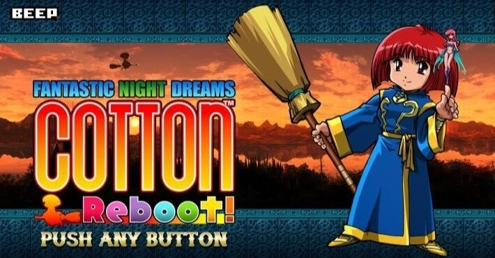
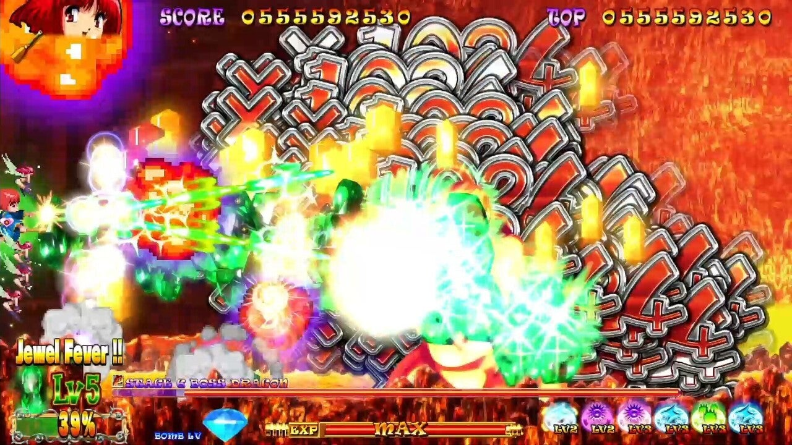

<figure>

</figure>

　90年代にゲーセンを賑わせたシューティングゲーム『コットン』がリメイク移植された。その名も『コットンリブート！』。リリースしたのはレトロゲーム販売に強いBEEPだ。『コットン』は決して無名なゲームではないが、すごくメジャーなゲームでもない。この辺りの絶妙なところを突いたセレクトがさすがBEEP。

　僕は当時『コットン』をあまりプレイしなかった。パワーアップのためのクリスタルアイテムが重力に引かれて落下する仕様。そのクリスタルを撃つことで色を変え、特定の色で取得することで増えるボム（魔法）。そこがプレイしにくさを生み出しているゲームデザインで、もうそれだけでストレスフルでやる気をなくすには十分だった。

　今回の『コットンリブート！』は、オリジナルの意地悪なゲームデザインを見事に解消してリメイクしてきた。ありがたい。昔のゲームを現代に蘇らせるからにはこうでなければ。

　特に、クリスタルが落下しないで、空中にとどまってくれる仕様にしたのは、それだけでゲームのストレスがなくなった。さらに、クリスタルの出る量も多くなり、なおかつそのクリスタルを撃つことで、ショットが拡散して強力になるのも素晴らしいアイデアだ。

　結果として『コットンリブート！』は、とにかくクリスタルを撃ちまくり、得点と魔法をかせぐことがゲームの攻略のキモとなっている。フィーバーモード突入で、ものすごい勢いでスコアが上昇していくのも、より今風のゲームデザインで気持ちいい。BEEPは、ゲーム事業参入第一作にして、実にいい移植をしてくれたと感心してしまう。

　しかし、今度は困ったことに画面が派手すぎて何も見えなくなってしまうことに気づいた。ゲームの売りであるフィーバーモードに突入すると、弾も敵も見えなくて、それでミスをしてしまう。敵の動きもボスのパターンも覚えているのに、画面が見えなくて対応できないのだ。

　これは、2分間モード、5分間モードのタイムアタックでも顕著である。画面がうるさすぎて何が起きているかわからないがために、限られた時間で狙ったスコアリングが成立しにくく、ただの運ゲーになってしまうのだ。

　オリジナルの弱点を見事に解消して現代に蘇った『コットンリブート！』であるが、今度は新たな難点が出てきたようだ。もし、アップデートで画面の見にくい演出が改良されれば最高であるが、どうだろうか。

　いずれにしても、過去の作品が、こうして新たな形で我々の前に再び現れるのは嬉しいことである。BEEPには今後も鋭い視点でレトロゲームをリメイク移植してほしいところである。

[https://www.youtube.com/watch?v=EQ\_pjEazKFQ](https://www.youtube.com/watch?v=EQ_pjEazKFQ)
