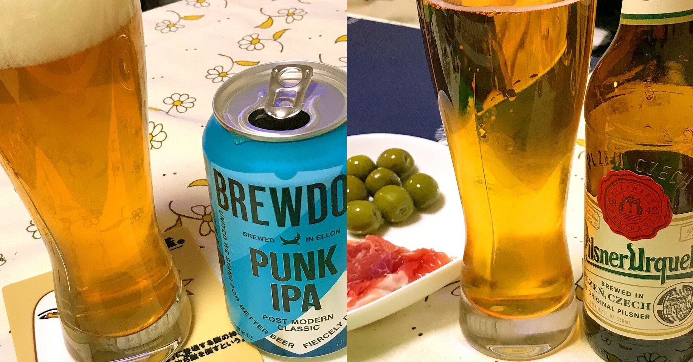
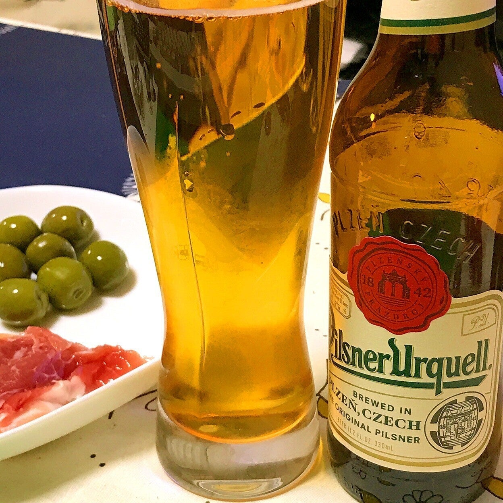
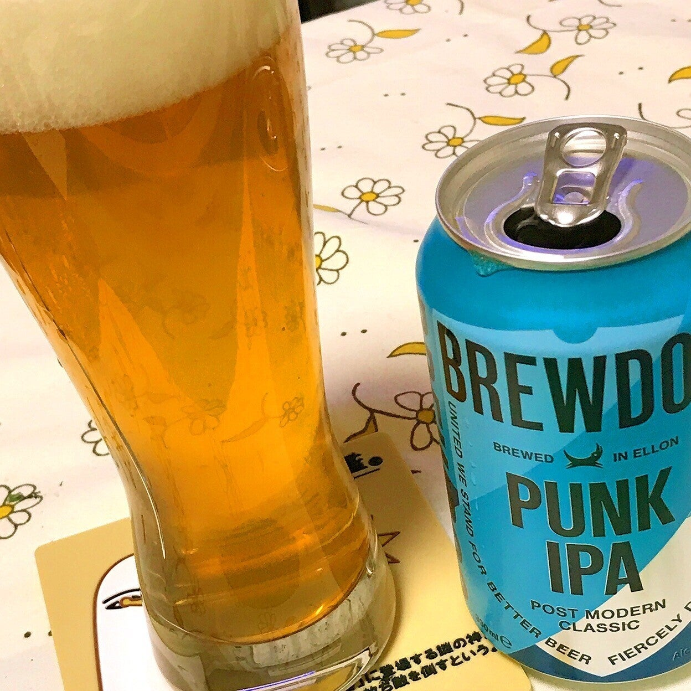
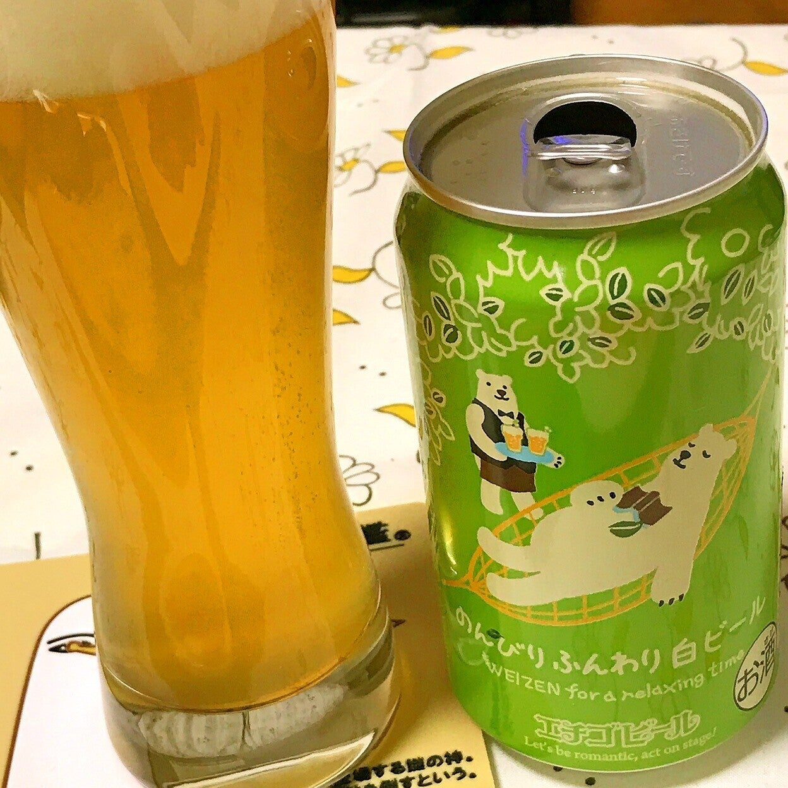
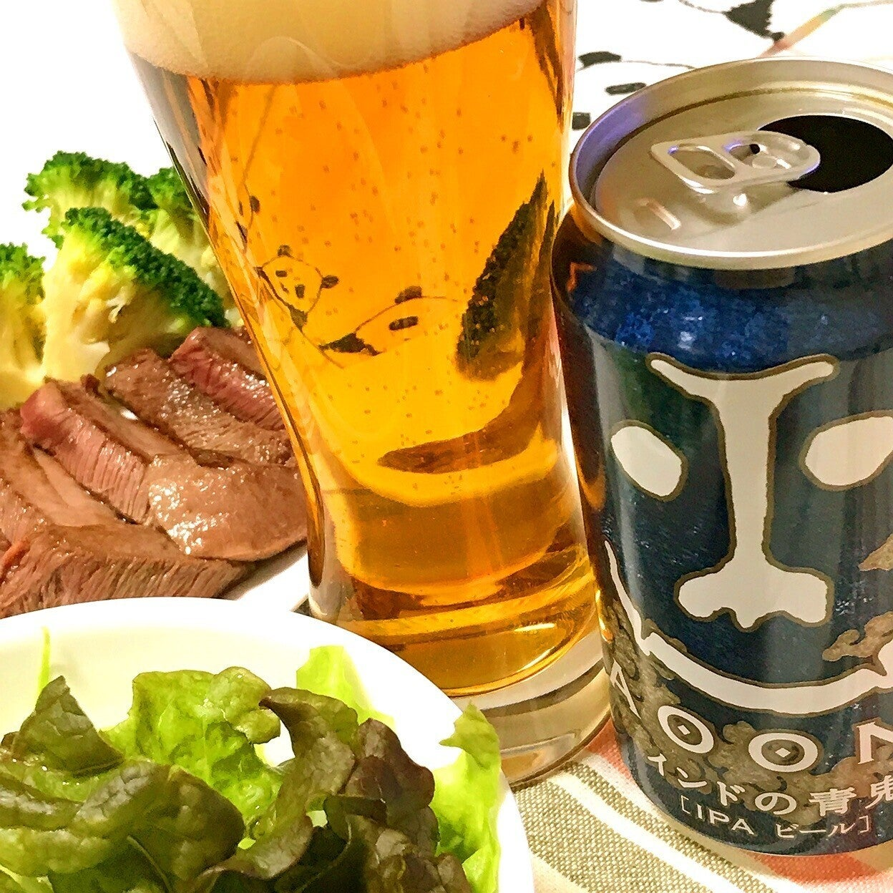
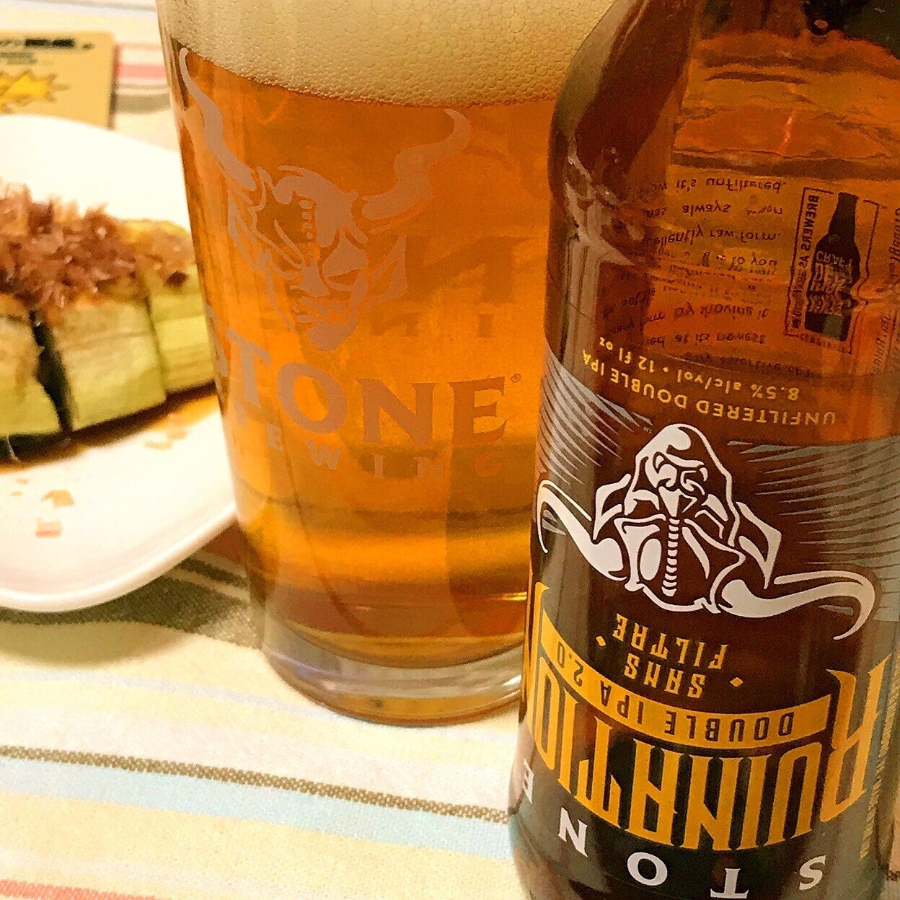
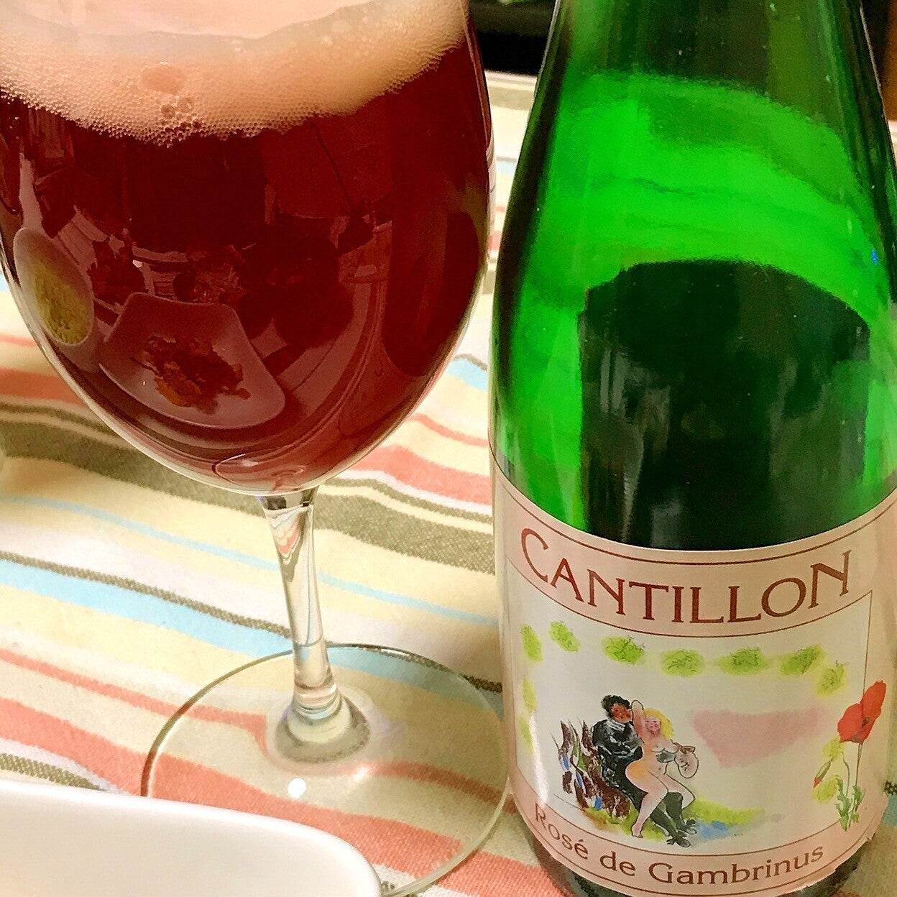
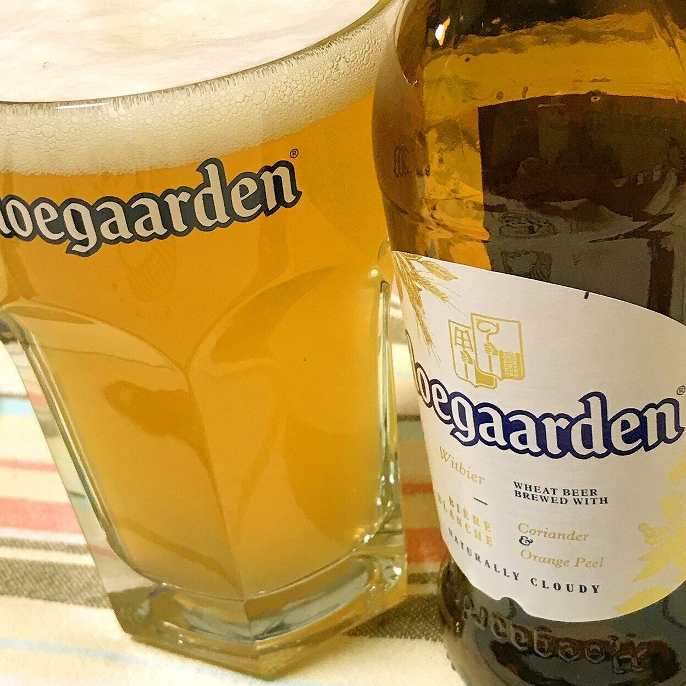
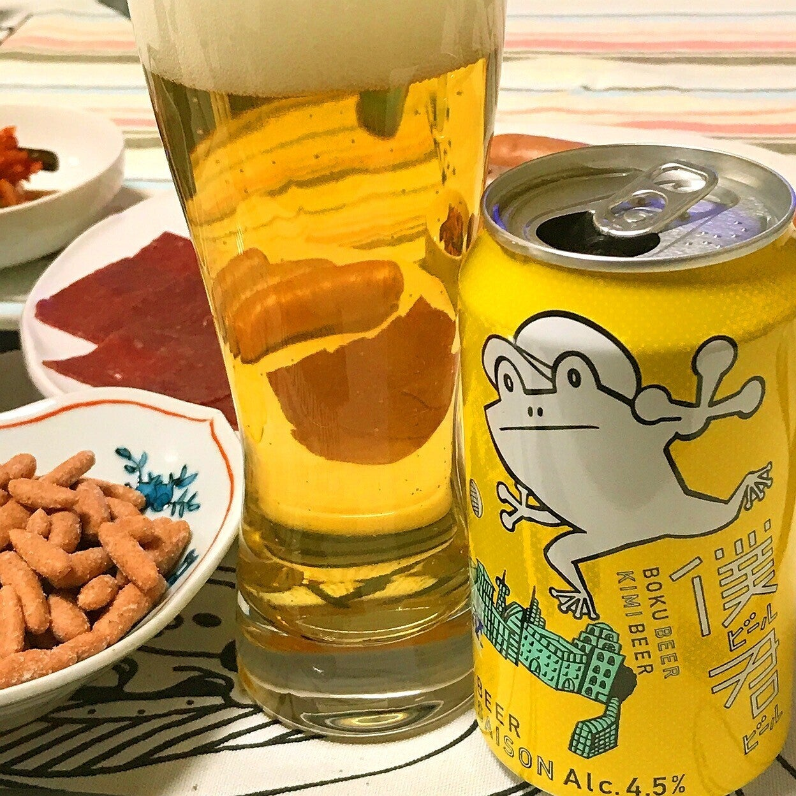

<figure>

</figure>

　いつもお酒を飲むときは、ウイスキーやウォッカ、ジンなどのスピリッツ中心なのだが、最近ビールにも興味が湧いて飲んでみようと思っている。で、ビールのことを全然知らないので、自分用にまとめてみてnoteに書き残しておこうというわけだ。

　日本では94年の酒税法改正により、全国に小さなブルワリーが作られた。これがいわゆる「地ビール」ブームの発端となり、以降21世紀にはクラフトビールと名を変えて現在に至る。（地ビールやクラフトビールの定義等には諸説あり）

　そんな中で、クラフトビールも含めて、色々なビールを飲んでみようというのが最近自分の中で流行っているというわけだ。そんなわけで、ここ1,2週間ぐらいで飲んでみたビールを書き残しておこう。

## ピルスナーウルケル

　1842年にチェコで誕生したピルスナースタイルの元祖。下面発酵のビールで、ザーツ産ホップに支えられた苦味と、切れ味のいいコクが楽しめる。冷やしてグイグイ飲めるのが魅力。2017年からはアサヒビールの傘下で伝統の味を作り続けている。アルコール度数4.4%。

## パンクIPA

　スコットランドで2007年よりビールを作り出したブリュードッグのIPA。大量のホップ由来の、IPAならではの苦味。グレープフルーツにも似た柑橘系の香り。そしてその中にも個性を失わない麦芽の甘みが渾然一体となった完成度の高い味。アルコール度数5.6%。IBUは40。今一番のお気に入り。

## のんびりふんわり白ビール

　新潟県のエチゴビールが作るヴァイツェン。その名の通り、「ゆったりくつろぐ時間のためのビール」として開発されている。酵母由来のふんわりと甘い香りと、全体的に抑え気味ながらかすかに漂うホップの苦味を楽しめる。アルコール度数5％。IBUは17。

## インドの青鬼

　ヤッホーブルーイングの代表的なIPA。グレープフルーツに似た柑橘系の香りと、強烈な苦味が楽しめる。商品名の由来は、IPAのインド、ホップの青、鬼のような苦味、ということだそうだ。アルコール度数7.0%。IBUは60。すごいね。

## ストーン ルイネーション ダブルIPA2.0 ソン・フィルトル

　カリフォルニアのサンディエゴに拠点を置くストーンブルーイングのダブルIPA。ホップの爽やかな香りが満載で、なおかつ飲んだ後に長く続く苦味が強烈。以前にあったダブルIPAを無濾過にしたバージョンで、より素材の味が楽しめるらしい。アルコール度数8.5%で、IBUは100！

## カンティヨン・フランボワーズ ロゼ ド ガンブリヌス  

　ベルギーの伝統的なビールであるランビック。そのランビックに木苺（ラズベリー/フランボワーズ）を漬け込んで発酵させるフルーツランビック。酸っぱいと聞いていたが、予想以上に酸っぱかった。ビネガーを思わせる味は鮮烈。アルコール度数5.0%。

## ヒューガルデンホワイト

　ベルギーのヒューガルデン村発祥のビール。売上、シェアNo.1のアンハイザー・ブッシュ・インベブ社傘下故に今ではどこでも見かける。スタイルはホワイトエールで、オレンジピール、コリアンダーなどを使用しているとのこと。香りは爽やかで口当たりもよく軽め。アルコール度数5.0%。

## 僕ビール君ビール

　ヤッホーブルーイングの、缶デザインがユーモラスなローソン限定ビール。公式サイトによると、ベルギー南部で、夏限定で飲まれていたセゾンスタイルのビールとのこと。マスカットの香りが特徴らしいが、なるほど果実っぽい香りが爽やか。アルコール度数4.5%でキレがいいのでゴクゴク飲める。

　アルコール度数書いておくのは、次飲むときに酔っ払い具合いをコントロールするため。  
　というわけで、またなにか飲んだら書く。Drink & Write。
