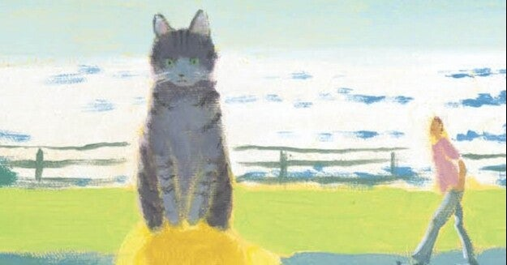

<figure>

</figure>

　『夏への扉』を読んだのはもう35年ぐらい昔。１０年ほど前に出版された新訳版は読んでいなかったのだが、どうやら映画化がきっかけで書店でまた見かけるようになったので、この度手にとってみた。

　『夏への扉』の初出は1956年。もう半世紀以上が経つ名作だ。僕が読んだ当時でさえ古典的作品と呼ばれていたのだから、今なおSFの名作と呼ばれる本作が残したインパクトの大きさがうかがい知れる。

　ストーリーはいわゆるタイムトラベルものであるが、そのさきがけとなった小説ということで、プロットは単純である。しかし、それが逆にわかりやすさとなって、多くの人に受け入れられる作品となっているのだろう。

　作者のロバート・A・ハインラインは、機動歩兵という兵器が登場することで知られる『宇宙の戦士』や、月が地球の植民地として描かれる『月は無慈悲な夜の女王』などを世に送り出した作家で、アイザック・アシモフやアーサー・C・クラークと並んでSF界の[ビッグスリー](https://www.sfwriter.com/rmdeatho.htm)である。

　物語前半の、主人公に降りかかる理不尽な事件と、後半のSF設定を生かした展開のカタルシスのコントラストが素晴らしい作品で、ストーリー中に登場する主人公の飼い猫ピートが印象的なことから、よく猫好きにおすすめされる作品にもなっている。実際、この新訳版も、過去にハヤカワから出版された2冊も、猫がクローズアップされた表紙となっている。

　原題は『The Door into Summer』で、邦題の『夏への扉』はそのイメージそのままであり、この作品の爽やかな読後感にふさわしいタイトルである。35年ぶりに読むと、いい感じにストーリーを忘れていて、再度フレッシュな感動を味わえた気分だ。たまにはSFの古典に立ち返ってみるのもいいのかもしれない。

[https://www.amazon.co.jp/%25E5%25A4%258F%25E3%2581%25B8%25E3%2581%25AE%25E6%2589%2589-%25E6%2596%25B0%25E8%25A8%25B3%25E7%2589%2588-%25E3%2583%25AD%25E3%2583%2590%25E3%2583%25BC%25E3%2583%2588%25E3%2583%25BB-%25E3%2583%25BB%25E3%2583%258F%25E3%2582%25A4%25E3%2583%25B3%25E3%2583%25A9%25E3%2582%25A4%25E3%2583%25B3/dp/4152090596/ref=sr\_1\_3?\_\_mk\_ja\_JP=%25E3%2582%25AB%25E3%2582%25BF%25E3%2582%25AB%25E3%2583%258A&dchild=1&keywords=%25E5%25A4%258F%25E3%2581%25B8%25E3%2581%25AE%25E6%2589%2589&qid=1616024969&s=books&sr=1-3](https://www.amazon.co.jp/%25E5%25A4%258F%25E3%2581%25B8%25E3%2581%25AE%25E6%2589%2589-%25E6%2596%25B0%25E8%25A8%25B3%25E7%2589%2588-%25E3%2583%25AD%25E3%2583%2590%25E3%2583%25BC%25E3%2583%2588%25E3%2583%25BB-%25E3%2583%25BB%25E3%2583%258F%25E3%2582%25A4%25E3%2583%25B3%25E3%2583%25A9%25E3%2582%25A4%25E3%2583%25B3/dp/4152090596/ref=sr_1_3?__mk_ja_JP=%25E3%2582%25AB%25E3%2582%25BF%25E3%2582%25AB%25E3%2583%258A&dchild=1&keywords=%25E5%25A4%258F%25E3%2581%25B8%25E3%2581%25AE%25E6%2589%2589&qid=1616024969&s=books&sr=1-3)
