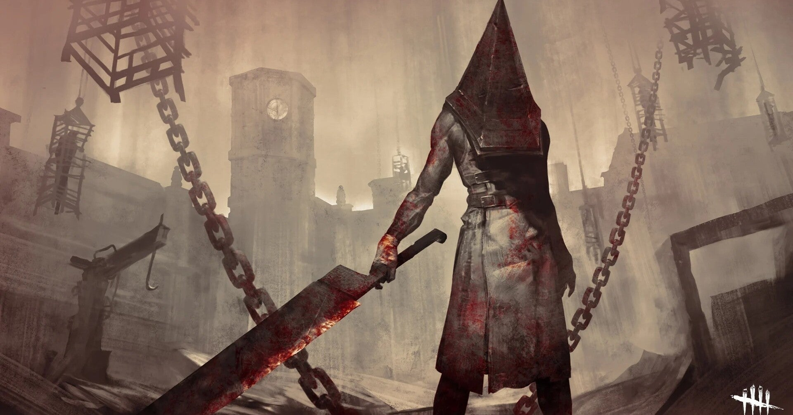

<figure>

</figure>

　『デッドバイデイライト』も5年目。僕がプレイし始めてから3年目。ひとつのゲームを遊んでいる時間としては長い方だ。

　遊んでいるプラットフォームも、PS4、PC、Switch、PS5と多方面に手を出している。その間にゲームの様々な進化（と退化）も見てきた。本当に息の長いゲームだ。

　こうなってくると、このゲームがどこまで行くのか見極めてみたいと思うようになってくる。オンラインゲームでサービス終了まで見届けたゲームと言うと、『ファンタシースターオンライン』ぐらいじゃないだろうか。大抵は、サービス終了を待たずに自分の方が飽きてくる。

　『デッドバイデイライト』はオンラインゲームなので、プレイしている間にたくさんのフレンドもできた。今も引き続き遊んでいる人もいれば、もうプレイしなくなった人もいる。

　『デッドバイデイライト』を遊び始める切っかけになったフレンドもすでにやめてしまっていて、今は別のゲームで遊んでいるようだ。しかし、そのフレンドもSNSなどでも繋がっていたのが、ツイッターなんかもすべてリムーブされて、オンラインで遊ばなくなるとそんなものかとちょっと寂しくも思いながら、別に仕方がないかなとも思っている。いや、ちょっと冷たいんじゃないかという気持ちも本当はあるんだけど、そんなのは勝手な思い込みで、このゲームに入れ込みすぎているのかもしれない。

　いずれにしても、まだ少しこのゲームは遊んでいこうと思っている。自分的にはまだまだ面白い。日々変化や発見があって、以前に比べるとかなり慣れてきて手癖でプレイしているようなところもあるけど、でもまだしばらくは楽しめそうだ。これからも遊んでいこう。

　個人的にはゲームをきっかけにフレンドになった人とは末永くいろいろなところで話題を共有してもいいかなと思っている。世の中そうじゃない人もいるから人それぞれで。機会があればまたいつか会えるといいね。
