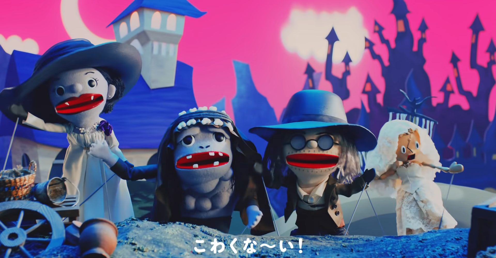

<figure>

</figure>

　『バイオハザード8』こと『バイオハザードヴィレッジ』が発売になった。以前より楽しみにしていた、シリーズ最新作だ。

　バイオハザードシリーズは、かつてプレイステーションで発売された初代からずっとプレイしている。エポックメイキングであった『バイオハザード4』や、続く『バイオハザード５』は、相当やり込んだ。

　その後、『バイオハザード6』でシリーズは若干パワーダウンを見せる。見かけこそ4以降のTPSスタイルを取っているものの、視点の悪さ、ダメージを受けたときの動き、QTEの乱用など、様々なことがゲームとして残念で、このときはちょっとバイオハザードシリーズから心が離れていた。

　ところが2017年に発売された『バイオハザード7』は、4〜6のTPSスタイルをあっさり捨て、FPSに変化していた。いかにも海外向けに流行りのゲームシステムを採用したようにも見えたが、プレイしてみるとこれが面白い。ホラー要素はもちろんだが、それよりもシューティングゲームとしての要素が重視されていて遊びごたえがあった。ゲームファンはこういうのを待っていたんだよ、という気持ちであった。

　そしてこの5月に、いよいよ『バイオハザード8』が発売になった。前作の続編的なストーリーと、大成功したFPSのスタイルを継承し、操作感もこなれていて実にいい。なおかつ今回は、PS5でプレイしてみた。折しも初めての4Kモニター環境を導入したのと相まって、グラフィックもこれまでと比べて一段上の表現で楽しめる。

　結局、発売日から3日間をかけてエンディングまでたどり着いた。あせってクリアしようとしたわけではないのだが、ゲームの面白さに引き込まれて、気づいたら終わっていたという印象だ。プレイ時間も長すぎず、短すぎず、ほどよい感じだったのも好印象である。個人的にはQTEが一切なかったのもよかった。

　プレイしてみて、もしかすると『バイオハザード８』は、『バイオハザード４』の軽快なプレイ体験を取り戻そうとして作られているのではないかと感じた。複雑すぎない謎、煩雑なお使いにならない程度のキーアイテム、銃器をカスタマイズ・パワーアップする楽しさなど、どうしてもかつて熱中した『バイオハザード４』の感触が思い出される。見た目は『バイオハザード７』の続編という雰囲気ながら、前作よりはるかに軽妙な攻略が可能な作りが特徴的だ。

　『バイオハザード８』を初めてプレイするプレイヤーたちは、本作から新しく登場する敵の、あまりに激しい動きに度肝を抜かれるかもしれない。序盤から難易度の高さを感じさせる調整は、やりごたえ十分である。しかしながら、落ち着いてプレイすることでこれらの難敵に対処できるようになることもまた、秀逸なレベルデザインを感じさせてくれる。プレイヤーに上達した実感を持たせるのがうまい作りである。

　さて、とりあえずクリアしてしまった『バイオハザード８』だが、嬉しいことにまだまだやりこみ要素が用意されている。隠された武器の入手や、さらなる高難易度モード、何より次々に迫りくる敵を時間内に撃破してスコアを競う『マーセナリーズ』が遊べるのも非常に楽しみだ。時間をかけて楽しんでいきたい。

　ところで、『バイオハザード７』が怖すぎたという評判から、本作では楽しさを前面に押し出したトレイラーが多数発表されているそうだ。カプコンの力の入れようがわかるというものだが、いくらトレイラーが楽しくても、本編の怖さは変わらないと思うよ。
