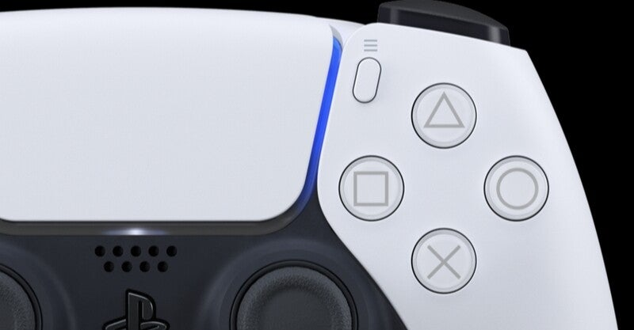

<figure>

</figure>

　PS5を買って5ヶ月。毎日楽しいゲームライフを送っている。

　しかし、ここへ来てまたコントローラーが壊れてしまった。「また」というのは、これまでにSwitchで3個買ったプロコントローラーすべて、Xbox One用のコントローラーなど、多くのコントローラーが故障する憂き目に遭っているからに他ならない。

　壊れた箇所はRとLのアナログスティック。これが、「ドリフト」と呼ばれる現象に見舞われ、何も入力していなくても、勝手にキャラクターが動いてしまう。FPSである『バイオハザード８』をプレイしている最中にも、的に狙いを定めていざ撃とうとしたら、キャラクターが真横を向いて弾を発射するなんてことが頻繁に起きてしまう。これではゲームにならない。

　以前より、コントローラーは消耗品。壊れるのは仕方ない。と割り切ってはいるものの、買って5ヶ月で故障はちょっと悲しい。いや、もっと早く壊れたコントローラーもいっぱいあるんだけど。いずれにしても、7000円もするコントローラーが消耗品では、経済的にはあまりに苦しい。なんとかしてほしいものだ。

　とりあえず、保証期間内ということで、すぐにソニーに送ってしまった。その間ゲームができなくなってしまうので、仕方なく代替のコントローラーを買ってしまった。いつもこのパターンだ。もっとも、着払いで送ることができて、webから修理依頼を受け付けることもできないマイクロソフト辺りよりは遥かにまともではあるのだけど。

　修理に出すまでにネットで調べてみたのだが、どうやらこのドリフト現象は、典型的な故障の一例らしい。今の時代、eスポーツやゲーム配信で収入を得る人もいるというのに、肝心のコントローラーが、こんなに弱々しいのは困るのではないだろうか。

　ゲーム機メーカーには、ぜひ普及品のコントローラー以外に、プロ仕様の高耐久性コントローラーを発売してほしいと思う。別にプロでなくても、毎日必ずゲームをする人用には、多少高くても壊れないコントローラーを作ってほしい。高耐久チタン軸受に、高耐久腐食防止金メッキ接点。よくわからないけど、そういうデラックスな部品で作った、10年は壊れません！　というような製品を開発してほしい。

　そう考えると、かつてゲームセンターで、不特定多数のゲーマーの使用に耐え、何年も使い続けられているアーケード用のレバーやボタンはすごいと思う。もちろん今のインテリジェントなコントローラーとは構造も部品数も違うだろうが、それでも不特定多数のゲーマーの、決して上品とは言えない使い方にもかなりの年数を耐えることができる。家庭用のコントローラーにも、そういう強靭さが欲しい。

　リアルの振動や、場面や状況によって押し込み抵抗の変化するコントローラーもすごいのだが、今はそれよりも高耐久性のコントローラーが欲しい。とにかく壊れないでくれ！　それがヘビーユーザーとしてもっとも切実な願いである。

　ついでに言うと、PS5はサードパーティ製のお安いコントローラーが早いところ普及してほしい。このペースで純正品が故障するのではちょっとかなわない。
