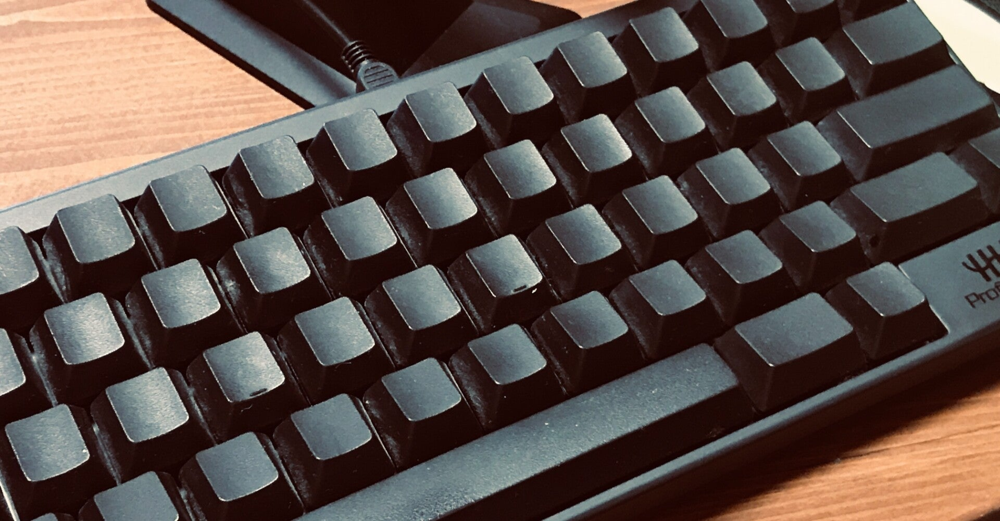

<figure>

</figure>

　リビングのソファでキーボードを使うために、長らく眠っていた『墨キーボード』を引っ張り出してきた。

　このキーボード、正式な名称は『Happy Hacking Keyboard Professional2 墨／無刻印』である。その名の通り、キートップに文字が刻印されていないのだ。

　以前東プレの『REALFORCE』の記事を書いたのだが、この『墨キーボード』も、それと同じキーで、実に格調高いキータッチが味わえる逸品だ。値段は東プレのものより高い。

[https://note.com/keigox68000/n/n74f057e26d30](https://note.com/keigox68000/n/n74f057e26d30)

　買った当時、結構ブラインドタッチができるようになっていたので、調子に乗って買ってしまったのだが、一応満足度は高い。長時間文字を打っていても疲れないし、指が自然にキーボードを走る感じで文字を入力できる。素晴らしいキーボードである。

　残念ながらその後あまり出番がなくなってしまっていたのだが、ソファの横にサイドテーブルを置いたことで、また小さいキーボードを使いたくなり、出番が回ってきたのだ。

　幸いサイドテーブルにジャストサイズで、このときのために買っておいたんじゃないかと思いたくなるぐらいピッタリの大きさでちょっと感動すら覚えてしまう。

　ところが、10年ぶりぐらいに使う『墨キーボード』。文字を入力するのには困らないのだが、ファンクションキーや特殊文字、ALTやCTRLが独自配置すぎて大いに困っている。カーソルキーすらなくて、機能キー＋何かのキーを押さなければカーソルを動かせないのだ。ちなみに、今入力した「＋」もどこにあるのかよくわからなくて、「ぷらす」から変換した。

　しかし、せっかくの高級キーボード。ここで使い倒さなければもったいないとばかりに、メーカーサイトからキーボード配列表と使い方等々をダウンロードして印刷し、設定を一から見直してもう一度使うことにした。

　正直、無刻印のキーボードを買っておきながら、その横にキー配列表を置いてあるのはまったくの本末転倒で、非常にかっこ悪い気がするのだが、仕方ない。また再びこのキーボードが自由自在に使えるようになるまで少しの辛抱だ。

　実はそんなこともあって、しばらくお休みしていたnoteも再開したのだったりする。がんばろ。
