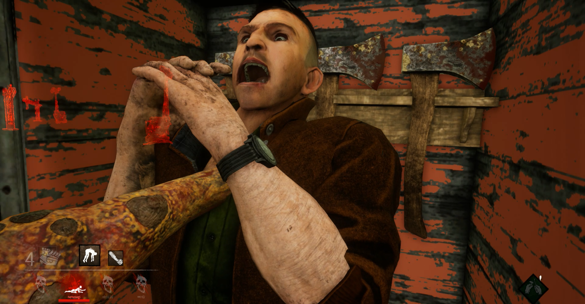

<figure>

</figure>

　相変わらず毎日遊んでいる『デッドバイデイライト』。今日は遊ばなかった。なぜかと言えば、いつまで経ってもマッチングしないから。

　このゲームはオンラインのサービスが始まってから5年が経とうというのに、さっぱりマッチングの技術が仕上がってこない。

　たぶん、プレイヤーの腕前と、それをいかに考慮してマッチングさせるかということ。さらに、そうやってマッチングシステムを改良している間にも、プレイヤーの技量が上がってしまい、打ち止めみたいな状態の上級者が多くなっていること。もうひとつ、スキルレーティングという新システム導入に失敗したこと。そんなことが重なって相変わらず上手くいかないのだろう。

　それにしても、最低ランクのランク20だと30分以上マッチングしないこともあって、新規プレイヤーにはまったく優しくない。もっと言うと、少し上達して、ランク15前後まで到達すると、突如最高ランクのランク1のプレイヤーとマッチングさせられて、恐らく不愉快なゲームプレイになってやっぱり初心者に優しくない。

　つまり何がいいたいかと言うと、ろくに腕前を考慮したマッチングが上手くいってないくせに、待たせすぎだということだ。

　平素からバグも多く、今回は定期的に訪れるランクリセットが、めちゃくちゃなランクに落とされたということでネット上では阿鼻叫喚となっている。お詫びにブラッドポイントという、スキルと交換できるポイントを配ったが、それも全員に配るのではなく、コードを入力して能動的に受け取りに行かないと手に入らない仕組み。

　これでよくみんなプレイを続けているというものだ。いや、人のことは言えないんだけど。

　しかし、最近流石にマッチングしないゲームはどうなのかと考えるようになってしまう。ちょうど『バイオハザード8』も発売されたタイミングなので、今日はそちらを主に遊んでいた。

　プレイ動画の配信を中心に人気が急上昇した『デッドバイデイライト』だが、そろそろシステム周りを少し堅牢にして、初期から残っているバグなんかも潰して、よりユーザビリティを高くしないとまずいのではないか。

　何よりも、30分間もマッチング画面で待っている自分はどうすればいいのか。普通のゲームではありえない悩みである。
